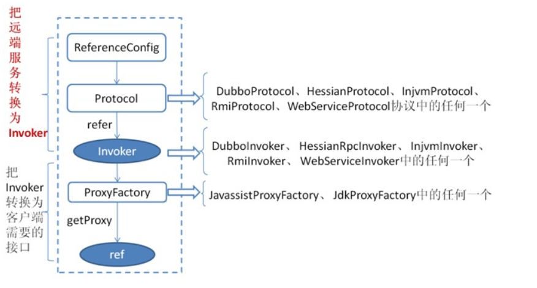

## dubbo服务发布与引用

overview todo
1. 基本配置解析
2. 其他属性

#### 服务信息 & 注册中心配置(使用ZooKeeper)

```
<!-- 服务发布的应用-->
<dubbo:application name="demo-provider" />
<!-- 注册中心 -->
<dubbo:registry address="zookeeper://192.168.1.46:2181"/>
<!-- 提供服务的端口 -->
<dubbo:protocol name="dubbo" port="20880" />
<!-- interface 服务接口， ref 服务实现类-->
<dubbo:service interface="pro.jing.api.DemoService" ref="demoService" />

```

dubbo自定义标签处理器：
```
http\://dubbo.apache.org/schema/dubbo=com.alibaba.dubbo.config.spring.schema.DubboNamespaceHandler
```


在DubboBeanDefinitionParser.parse中，完成3个逻辑 <br>
1. get attribute name。如果存在 id=name。如果不存在ProtocolConfig生成默认名字dubbo, 有interface属性的元素获取interface属性。还是没有生成beanName就用beanClass.getName()+计数器的逻辑生成。 <br>
2. 注册到spring容器 <br>
3. 对应的配置类的属性设置 <br>

基本配置对应在Dubbo中的类示意图：


#### 服务发布

在com.alibaba.dubbo.config.ServiceConfig.export()实现服务发布的功能。服务暴露配置dubbo:service对应的类是ServiceBean。ServiceBean是一个ServiceConfig


ServiceBean同时是一个监听ContextRefreshedEvent事件类型的监听器。容器在刷新方法中的最后发布ContextRefreshedEvent事件。
调用链：


发布流程除了必要的各种配置检查之外，实现真正发布的逻辑是： <br>
1. 生成实现类的Invoker <br>
2. 生成Exporter <br>
3. 调用Exporter.export()发布 <br>

发布流程示意图:.


>dubbo 文档：首先 ServiceConfig 类拿到对外提供服务的实际类 ref(如：HelloWorldImpl),然后通过 ProxyFactory 类的 getInvoker 方法使用 ref 生成一个 AbstractProxyInvoker 实例，到这一步就完成具体服务到 Invoker 的转化。接下来就是 Invoker 转换到 Exporter 的过程。 <br>
Dubbo 处理服务暴露的关键就在 Invoker 转换到 Exporter 的过程，上图中的红色部分。下面我们以 Dubbo 和 RMI 这两种典型协议的实现来进行说明：<br>
Dubbo 的实现 <br>
Dubbo 协议的 Invoker 转为 Exporter 发生在 DubboProtocol 类的 export 方法，它主要是打开 socket 侦听服务，并接收客户端发来的各种请求，通讯细节由 Dubbo 自己实现。  <br>
RMI 的实现 <br> 
RMI 协议的 Invoker 转为 Exporter 发生在 RmiProtocol类的 export 方法，它通过 Spring 或 Dubbo 或 JDK 来实现 RMI 服务，通讯细节这一块由 JDK 底层来实现，这就省了不少工作量。

Dubbu协议Invoker 转为 Exporter实现流程图：


Dubbo分为本地发布以及发布到注册器
```
本地发布：

if (!Constants.LOCAL_PROTOCOL.equalsIgnoreCase(url.getProtocol())) {
    URL local = URL.valueOf(url.toFullString())
            .setProtocol(Constants.LOCAL_PROTOCOL)
            .setHost(LOCALHOST)
            .setProtocol(0);
    ServiceClassHolder.getInstance().pushServiceClass(getServiceClass(ref));
    Exporter<?> exporter = protocol.export(
            proxyFactory.getInvoker(ref, (Class) interfaceClass, local));
    exporters.add(exporter);
    logger.info("Export dubbo service " + interfaceClass.getName() + " to local registry");
}

远程发布

    Invoker<?> invoker = proxyFactory.getInvoker(ref, (Class) interfaceClass, registryURL.addParameterAndEncoded(Constants.EXPORT_KEY, url.toFullString()));
    DelegateProviderMetaDataInvoker wrapperInvoker = new DelegateProviderMetaDataInvoker(invoker, this);

    Exporter<?> exporter = protocol.export(wrapperInvoker);
    exporters.add(exporter);
```

#### 服务引用

引用配置:
```
<!-- 引用服务配置-->
<dubbo:reference id="demoService" interface="pro.jing.api.DemoService"/>
```
reference对应的类名ReferenceBean,ReferenceBean也是要给FactoryBean。初始化时调用getObject生成代理对象(Invoker)。


初次初始化，调用init()
```
private transient volatile Invoker<?> invoker;

invoker = refprotocol.refer(interfaceClass, url);

public <T> Invoker<T> refer(Class<T> serviceType, URL url) throws RpcException {
    optimizeSerialization(url);
    // create rpc invoker.
    DubboInvoker<T> invoker = new DubboInvoker<T>(serviceType, url, getClients(url), invokers);
    invokers.add(invoker);
    return invoker;
}
```

消费服的服务消费都是通过生成的invoker代理来实现调用。这个代理包含了请求封装，remoting细节等。

 


 
