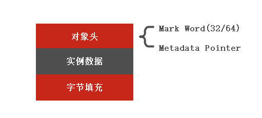
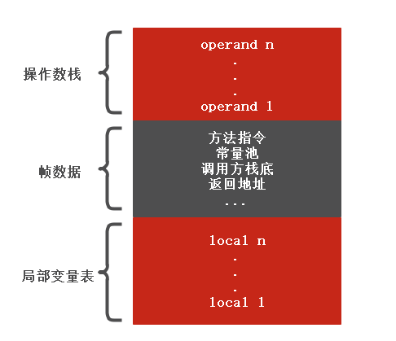

## Java 内存

##### 内存区域

* Java 堆:该区域的大小在虚拟机启动时便分配(-Xms -Xmx参数用于调整堆最小最大值)。用于存放对象以及数组实例，线程共享。存放的对象的内存布局：

堆分为新生代和老年代。新生代又分为eden，survivor space0(s0),survivor space1(s1)。新创建的对象在eden中，至少经历过一次的对象在s0,s1中。达到一定年龄的对象则进入老年代。

* 方法区(JDK 1.8 的mataspace)：存放类型信息，常量池，域信息，方法信息。
* 虚拟机栈：方法执行的线程模型。方法从开始执行到结束对应一个栈帧的入栈到出栈。线程私有，在方法开始调用前分配大小(-Xss 设置栈帧大小)。栈帧中包含局部变量表，操作栈以及帧数据。

栈大小设置: -Xss 4M;这个参数影响函数调用的深度。方法内部局部变量，参数越多，栈帧占用的内存越大，调用深度越小。相同的局部变量，参数，栈大小越大，能够调用的深度越深。另外一个考虑的方面是局部变量表复用。
* 本地方法栈:本地方法执行的线程模型
* 程序计数器(PC)：执行的字节码的行号指示器
* 直接内存：一些方法执行直接申请os的内存

#### 参数设置
-Xmx:最大堆内存，新生代+老年代
-Xms:最小堆内存,JVM启动时初始化堆的内存为Xms设置的大小。在允许过程中动态扩展
-Xmn:配置新生代的大小
-XX:NewSize 新生代初始大小
-XX:MaxNewSize 新生代最大大小
-XX:SurviorRatio eden/s0比例， s0 = s1

#### 内存分配
* 堆上分配的线程同步问题。
* 对象优先在Eden分配，大对象直接进入老年代，长期存活的对象进入老年代

#### 内存回收 

* 对象存活判断方法
    
    + 引用计数器：一个对象每被引用一次计数器+1，减少一次引用-1。会有循环引用的问题，导致以及没有用的对象但是计数器！=0
    + 可达性分析：通过一个GC Root链接对象。不在引用链上的对象则为垃圾对象。可作为GC Root的对象分为：
      
        + 虚拟机栈中引用的对象
        + 本地方法栈中引用的对象
        + 方法区静态属性引用的对象
        + 方法区中常量引用的对象
    
* 垃圾回收
    + 回收算法
        * 标记-清除：标记对象为垃圾，然后清除。效率低下，内存碎片
        * 复制：内存分块，每次只是使用其中一块，回收时将存活对象复制到另外一块。内存分块的比例直接影响浪费的内存空间或者说内存的有效使用空间并不是整块内存区。复制操作性能也是考虑因素之一。
        * 标记-整理：让存活的对象向另外一侧移动，然后直接清除掉可用一侧以外的所有内存。
        * 分代收集算法：不同分代的内存区域用不同的收集算法。
    + 收集器
        * serial收集器：单线程收集器(单线程工作，且会stop the world)。
        * parnew收集器：serial的多线程版本。多线程工作，会stop the world。
        * Parallel Scanvange:关注吞吐量(工作时间/工作时间+停顿时间)。停顿时间可用-XX:MaxGCPauseMills参数设置。-XX:GCTimeRatio设置吞吐量大小。
        * serial old:老年代的收集算法，用标记-整理算法回收。单线程。
        * Parallel Old:Parallel New的老年代版本。
        * CMS(Current Meark Sweep):关注停顿时间，以最短停顿时间目标 
        * G1(Garbage-First):将堆内存分区，跟踪每个region的垃圾回收价值分优先级。

#### JVM 参数
* -Xms -Xmm 配置堆内存大小
* -Xss 配置栈的最大值
* 