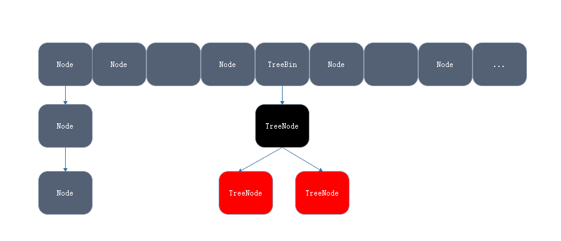
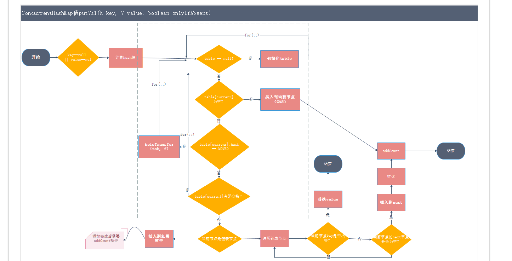

## ConcurrentHashMap 详解(一)
>CouncurrentHashMap是为并发设计的HashMap，JDK1.8通过自旋，synchronized,CAS提高put的性能。volatile的成员变量使得get()的操作都已经是可见的。

#### ConcurrentHashMap 源码解析 JDK 1.8
##### 数据结构
```
	public class ConcurrentHashMap<K,V> extends AbstractMap<K,V>
    implements ConcurrentMap<K,V>, Serializable {
    	...
    	private static final int DEFAULT_CAPACITY = 16;
    	private static final float LOAD_FACTOR = 0.75f;
    	transient volatile Node<K,V>[] table;
    	private transient volatile Node<K,V>[] nextTable;
    	...
    }

    static class Node<K,V> implements Map.Entry<K,V> {
    	...
    	final int hash;
        final K key;
        volatile V val;
        volatile Node<K,V> next;
    	...
    }

    static final class TreeBin<K,V> extends Node<K,V> {
    	...
    	TreeNode<K,V> root;
        volatile TreeNode<K,V> first;
        volatile Thread waiter;
        volatile int lockState;

        // values for lockState
        static final int WRITER = 1; // set while holding write lock
        static final int WAITER = 2; // set when waiting for write lock
        static final int READER = 4; // increment value for setting read lock
    	...
    }.
```
JDK 1.8中用Node<K,V>[] table保存数据中的节点，节点的类型可能是Node也可能是TreeBin。TreeNode是红黑色的头，不保存key,value而是保存TreeNode列表和列表的root</br>
其存储的结构图示：


##### CouncurrentHashMap.put()实现
```
	public V put(K key, V value) {
        return putVal(key, value, false);
    }

```
**putVal(key, value, false)详细解析：**

putVal流程图:


+ 空指针检测,保存的key和value都不可以为空
```
	if (key == null || value == null) throw new NullPointerException();
```
+ 计算hash值
```
	int hash = spread(key.hashCode());
```
+ 自旋添加

```
	for (Node<K,V>[] tab = table;;) {
		...
	}
```
进入添加流程for(;;)：</br>

+ 如果table为空，先初始化table,容量为DEFAULT_CAPACITY = 16
```
	if (tab == null || (n = tab.length) == 0)
        tab = initTable();
```
+ 如果 table[(n - 1) & hash]位置上的Node == 空，将新的Node放在这个节点。添加通过ＣＡＳ操作，没有用锁
```
	else if ((f = tabAt(tab, i = (n - 1) & hash)) == null) {
        if (casTabAt(tab, i, null,
            new Node<K,V>(hash, key, value, null)))
                break;     // no lock when adding to empty bin
    }


   static final <K,V> boolean casTabAt(Node<K,V>[] tab, int i,
        Node<K,V> c, Node<K,V> v) {
    	return U.compareAndSwapObject(tab, ((long)i << ASHIFT) + ABASE, c, v);
    }
```
+ 这是干嘛？？ TODO
```
  else if ((fh = f.hash) == MOVED)
        tab = helpTransfer(tab, f);
```
+ 如果table[(n - 1) & hash]位置上的Node不为空,则对这个节点加锁修改或在对应的链表或红黑色添加新节点
```
	synchronized (f) {
		...
	}

```
进入更新或添加部分，一般Node
```
	  if (fh >= 0) { //TreeBin的哈希值 == -2
        binCount = 1;
        for (Node<K,V> e = f;; ++binCount) {
            K ek;
            //比较新Node和旧的Node的hash，相等则替换
            if (e.hash == hash &&
                ((ek = e.key) == key ||
                (ek != null && key.equals(ek)))) {
                    oldVal = e.val;
                    if (!onlyIfAbsent)
                        e.val = value;
                            break;
                    }
            Node<K,V> pred = e;
            //当前结点的下一个节点为空，则new Node是当前节点的下一个节点
            if ((e = e.next) == null) {
                pred.next = new Node<K,V>(hash, key,value, null);
                    break;
            }
        }
    }
```
进入更新或添加部分，TreeNode
```
	else if (f instanceof TreeBin) {
        Node<K,V> p;
        binCount = 2;
        if ((p = ((TreeBin<K,V>)f).putTreeVal(hash, key,value)) != null) {
            oldVal = p.val;
            if (!onlyIfAbsent)
                p.val = value;
            }
        }
```
添加完成后查看链表的长度，看是否需要将Node链表转换成红黑树
```
    if (binCount != 0) {
    	// TREEIFY_THRESHOLD = 8
        if (binCount >= TREEIFY_THRESHOLD)
            treeifyBin(tab, i);
        if (oldVal != null)
            return oldVal;
            break;
        }
```
+ 如果是添加元素，map的容量+1
```
   addCount(1L, binCount);
```

##### CouncurrentHashMap.get()实现
```
    public V get(Object key) {
        Node<K,V>[] tab; Node<K,V> e, p; int n, eh; K ek;
        int h = spread(key.hashCode());
        if ((tab = table) != null && (n = tab.length) > 0 &&
            (e = tabAt(tab, (n - 1) & h)) != null) {
            if ((eh = e.hash) == h) {
                if ((ek = e.key) == key || (ek != null && key.equals(ek)))
                    return e.val;
            }
            else if (eh < 0)
                return (p = e.find(h, key)) != null ? p.val : null;
            while ((e = e.next) != null) {
                if (e.hash == h &&
                    ((ek = e.key) == key || (ek != null && key.equals(ek))))
                    return e.val;
            }
        }
        return null;
    }
```
通过hash找到当前的table的位置。如果是table[current],直接返回value。如果是当前节点是树节点，查找树上的各节点，然后返回，否则循环链表。在get()过程中，完全没有使用锁，所以可以实现高性能的读。