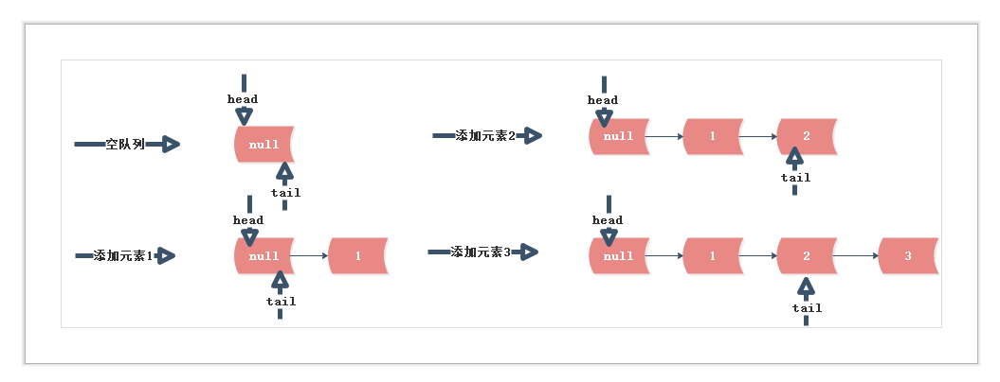

## ConcurrentLinkedQueue 源码解析
> ConcurrentLinkedQueue是线程安全的无界限队列的实现。源码实现没有用锁实现多线程下的安全访问，而是用自旋，CAS等手段。不使用锁增加了代码的复杂度，但是性能远好于用锁。

#### ConcurrentLinkedQueue 源码解析 JDK 1.8

##### 数据结构
```
	public class ConcurrentLinkedQueue<E> extends AbstractQueue<E>
        implements Queue<E>, java.io.Serializable {
        	···
        	private transient volatile Node<E> head;
        	private transient volatile Node<E> tail;
        	···

        	//初始化的时候，指向值为null的Node
        	public ConcurrentLinkedQueue() {
        		head = tail = new Node<E>(null);
    		}
        }	
```
ConcurrentLinkedQueue保存队列的头和尾节点。出队入队都是针对Node节点。

##### Node 数据结构
```
	private static class Node<E> {
        ...
        volatile E item;
        volatile Node<E> next;
        ...

        Node(E item) {
            UNSAFE.putObject(this, itemOffset, item);
        }
    }
```

##### Node操作，并发场合需要保证安全
```
	//设置Node item(value)
    boolean casItem(E cmp, E val) {
        return UNSAFE.compareAndSwapObject(this, itemOffset, cmp, val);
    }
    //设置Node next
    void lazySetNext(Node<E> val) {
        UNSAFE.putOrderedObject(this, nextOffset, val);
    }
    //设置Node next
    boolean casNext(Node<E> cmp, Node<E> val) {
        return UNSAFE.compareAndSwapObject(this, nextOffset, cmp, val);
    }
```
Node操作都是通过UNSAFE的CAS操作，保证更新正确

##### 入队 add()/offer()
```
	public boolean offer(E e) {
        checkNotNull(e);
        final Node<E> newNode = new Node<E>(e);
        //for(;;)
        for (Node<E> t = tail, p = t;;) {
            Node<E> q = p.next;
            //当下一个节点为空，设置新的节点为最后一个节点的next
            if (q == null) {
                // p is last node
                if (p.casNext(null, newNode)) {
                    //设置tail指向newNode,并不是及时更新tail的
                    if (p != t) // hop two nodes at a time
                        casTail(t, newNode);  // Failure is OK.
                    return true;
                }
                // Lost CAS race to another thread; re-read next
            }
            else if (p == q)//next指向自己
            	//多线程环境下，t!=t会有可能存在的(!= 不是原子操作)
                p = (t != (t = tail)) ? t : head;
            else
                //q != null, 查找新节点的前一个节点的位置
                p = (p != t && t != (t = tail)) ? t : q;
        }
    }
```
Concurrent的入队操作，插入包含在for(;;)</br>
在队尾插入if(q == null),p.casNext(null, newNode)。</br>
tail并不是及时更新的，插入2个Node,更新一次</br>
入队图示:</br>


##### 出队 poll()/peek()
```
//Retrieves and removes
 public E poll() {
        restartFromHead:
        for (;;) {
            for (Node<E> h = head, p = h, q;;) {
                E item = p.item;

                if (item != null && p.casItem(item, null)) {
                    // Successful CAS is the linearization point
                    // for item to be removed from this queue.
                    if (p != h) // hop two nodes at a time
                        updateHead(h, ((q = p.next) != null) ? q : p);
                    return item;
                }
                else if ((q = p.next) == null) {
                    updateHead(h, p);
                    return null;
                }
                else if (p == q)
                    continue restartFromHead;
                else
                    p = q;
            }
        }
    }
```
从head开始遍历。第一次进入,head.item == null,执行p=q。下一次遍历 item!=null,设置当前的结点的item = null,表示删除。 if(p != h),设置头节点，head作为哨兵(head.next = head,offer()操作需要排除这种情况)。

```
//Retrieves
    public E peek() {
        restartFromHead:
        for (;;) {
            for (Node<E> h = head, p = h, q;;) {
                E item = p.item;
                if (item != null || (q = p.next) == null) {
                    updateHead(h, p);
                    return item;
                }
                else if (p == q)
                    continue restartFromHead;
                else
                    p = q;
            }
        }
    }
```
