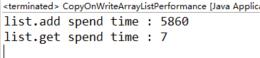
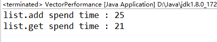

## CopyOnWriteArrayList 详解
> CopyOnWriteArrayList 是同步下的ArrayList的替代。CopyOnWriteArrayList适用于读多写少的场合。</br>
Vector也是ArrayList的并发安全实现。

###### CopyOnWriteArrayList & Vector 的性能比较

测试代码
```
	public class CopyOnWriteArrayListPerformance {

		public static void main(String[] args) {
			List<String> list = new CopyOnWriteArrayList<>();
			ListAccess.access(list, 100, 1000);
		}
	}


	public class VectorPerformance {

		public static void main(String[] args) {
			List<String> list = new Vector<>();
			ListAccess.access(list, 100, 1000);
		}
}

```
分别在ConpyOnWriteArrayList和Vector中添加100*1000个数据，然后访问1000次。完整测试代码[github](https://github.com/ChenjingEr/java-in-action/tree/master/java-multithreading/src/main/java/pro/jing/multithreading/collection/list/performance) /
[gitee](https://gitee.com/ChenJing-Cloud/java-in-action/tree/master/java-multithreading/src/main/java/pro/jing/multithreading/collection/list/performance) </br>

**测试结果：**</br>

 </br>
可以看到add()同样的数据量CopyOnWriteArrayList会比Vector慢很多，CopyOnWriteArrayList更加优于Vector。

#### CopyOnWriteArrayList的源码分析
###### 数据结构
```
	public class CopyOnWriteArrayList<E>
    implements List<E>, RandomAccess, Cloneable, java.io.Serializable {
    	...

    	final transient ReentrantLock lock = new ReentrantLock();

    	//数据存储的地方
    	private transient volatile Object[] array; 

    	...
    }
```

###### CopyOnWriteArrayList的get(int index)实现
```
	public E get(int index) {
        return get(getArray(), index);
    }

    private E get(Object[] a, int index) {
        return (E) a[index];
    }

       final Object[] getArray() {
        return array;
    }
```
get()的实现没有使用任何锁，直接通过array[index]返回数据。通过减少锁的竞争的消耗实现高性能访问。

###### CopyOnWriteArrayList的put(int index)实现
```
	public boolean add(E e) {
        final ReentrantLock lock = this.lock;
        lock.lock();
        try {
            Object[] elements = getArray();
            int len = elements.length;
            Object[] newElements = Arrays.copyOf(elements, len + 1);
            newElements[len] = e;
            setArray(newElements);
            return true;
        } finally {
            lock.unlock();
        }
    }
```
put()首先要获取锁，然后需要copy一个array副本，最后将副本写回。这里存在获取锁的消耗以及复制副本的消耗，故CopyOnWriteArrayList不适用于写入多的场景。