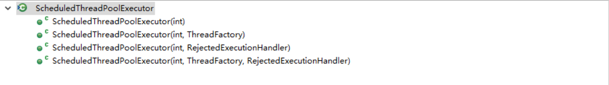

## 周期执行线程池原理

##### 看构造函数


构造函数仅提供corePoolSize, ThreadFactory, RejectedExecutionHand的参数构造。

##### 特定频率周期性执行任务提交
```
public ScheduledFuture<?> scheduleAtFixedRate(Runnable command,long initialDelay,
    long period,TimeUnit unit) {
    //包装任务成ScheduledFutureTask
    ScheduledFutureTask<Void> sft =new ScheduledFutureTask<Void>(command,null,
      triggerTime(initialDelay, unit),
      unit.toNanos(period));
    RunnableScheduledFuture<Void> t = decorateTask(command, sft);
    sft.outerTask = t;
    //延迟执行任务提交
    delayedExecute(t);
}
private void delayedExecute(RunnableScheduledFuture<?> task) {
if (isShutdown())
    reject(task);
else {
    //是DelayQueue
    super.getQueue().add(task);
    //shutDown时拒绝任务
    if (isShutdown() &&
        !canRunInCurrentRunState(task.isPeriodic()) &&
        remove(task))
        task.cancel(false);
    else
        //正常提交
        ensurePrestart();
    }
}

void ensurePrestart() {
    int wc = workerCountOf(ctl.get());
    if (wc < corePoolSize)
        addWorker(null, true);
    else if (wc == 0)
        addWorker(null, false);
}

```

ScheduleThreadPoolExecutor在提交之后，若线程池池还没有shutDown,添加到BlockingQueue中(DelayQueue)，同时如果池的工作线程还没有到corePoolSize，那么就添加一个工作线程。

##### 任务执行
ScheduleThreadPoolExecutor的任务单元是封装过的RunnableScheduledFuture。getTask()会从DelayQueue中获取任务(DelayQueue元素超时才会被获取)。worker执行task的run()方法:
```
public void run() {
    //是否需要周期执行
    boolean periodic = isPeriodic();
    //查看在当前状态 RUNNING || SHUTDOWN是否还继续要执行
    if (!canRunInCurrentRunState(periodic))
        cancel(false);
    //非周期性执行
    else if (!periodic)
        ScheduledFutureTask.super.run();
    //周期性执行
    else if (ScheduledFutureTask.super.runAndReset()) {
        setNextRunTime();
        reExecutePeriodic(outerTask);
    }
}
```
延迟执行在run一次之后task就结束。周期性执行方式先执行然后重置，计算出下一次执行的时间，重新添加到待执行队列中。