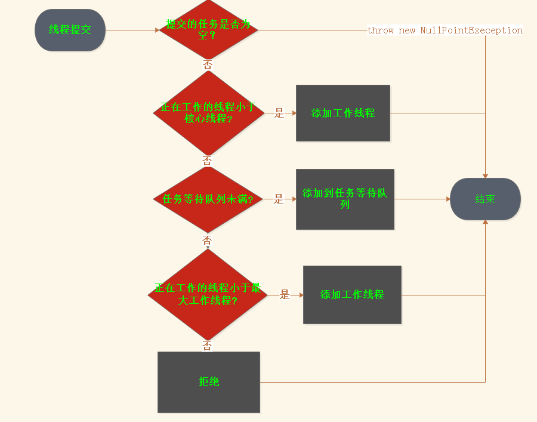

## 线程池原理

线程池是为了实现线程资源的复用存在。创建和销毁线程，以及线程本身也需要占用较大的内存，如果是n个线程去执行n个任务，那么创建和销毁n个线程以及n个线程占用的内存都是一笔大的开销。

在Executor框架中，ThreadPoolExecutor是基本的线程池的实现。ScheduledThreadPoolExecutor是周期性线程池的实现。

#### ThreadPoolExecutor源码分析:

##### 任务提交
```

public void execute(Runnable command) {
    //ctl包含了工作线程数量(0-28位)与线程池的生命周期(高3位)的两个状态。
    int c = ctl.get();
    //工作线程 < corePoolSize，创建新的线程用于执行提交的任务
    if (workerCountOf(c) < corePoolSize) {
        if (addWorker(command, true))
            return;
        c = ctl.get();
    }
    //添加到任务对垒等待执行
    if (isRunning(c) && workQueue.offer(command)) {
        int recheck = ctl.get();
        if (! isRunning(recheck) && remove(command))
            reject(command);
        else if (workerCountOf(recheck) == 0)
            addWorker(null, false);
    }
    // 没有超过maxPoolSize，建立线程执行任务
    else if (!addWorker(command, false))
        //超过maxPoolSize，执行拒绝策略
        reject(command);
}

```

任务提交的逻辑示意图：


* 创建工作线程并加入到工作线程队列
线程池的工作线程是Worker。Worker是ThreadPoolExecutor的内部类，继承AQS，实现Runnable
```
private final class Worker extends AbstractQueuedSynchronizer implements Runnable {

        ...
        final Thread thread;
        Runnable firstTask;
        volatile long completedTasks;

        Worker(Runnable firstTask) {
            setState(-1); // inhibit interrupts until runWorker
            this.firstTask = firstTask;
            this.thread = getThreadFactory().newThread(this);
        }
    }
```
Workder的构造函数里，firstTask是提交的任务，执行的线程用线程工厂生成。

ThreadPoolExecutor中缓存以及生成的线程:HashSet<Worker> workers。创建worker并保持到workers：
```
 Worker w = null;
    try {
        //创建一个Worker
        w = new Worker(firstTask);
        final Thread t = w.thread;
        if (t != null) {
            //添加需要同步操作
            final ReentrantLock mainLock = this.mainLock;
            mainLock.lock();
            try {
                //添加之前判断线程池当前的运行状态，防止其他线程调用shutDown || shutDownNow关闭线程还添加
                int rs = runStateOf(ctl.get());
                // rs < SHUTDOWN是RUNNABLE
                if (rs < SHUTDOWN ||
                    (rs == SHUTDOWN && firstTask == null)) {
                    if (t.isAlive()) // 线程不可以重复start
                        throw new IllegalThreadStateException();
                    //添加到集合
                    workers.add(w);
                    //当前集合的数量
                    int s = workers.size();
                    if (s > largestPoolSize)
                        largestPoolSize = s;
                    workerAdded = true;
                }
            } finally {
                mainLock.unlock();
            }
            if (workerAdded) {
                //启动workder中的线程
                t.start();
                workerStarted = true;
            }
        }
    } finally {
        if (! workerStarted)
            addWorkerFailed(w);
    }
```

##### Worker执行逻辑：
```
// 构造要给thread的逻辑,将当前作为Runnable传入Thread中，所以执行的是Workder实例的run方法
 this.thread = getThreadFactory().newThread(this);

public void run() {
    runWorker(this);
}

//执行的主体部分:runWorker()
 try {
    while (task != null || (task = getTask()) != null) {
        //lock住是为了执行过程不被池中断
        w.lock();
        if ((runStateAtLeast(ctl.get(), STOP) ||
             (Thread.interrupted() &&
              runStateAtLeast(ctl.get(), STOP))) &&
            !wt.isInterrupted())
            wt.interrupt();
        try {
            //自定义池的时候，可以实现一些扩展
            beforeExecute(wt, task);
            Throwable thrown = null;
            try {
                //业务定义的task执行逻辑
                task.run();
            } catch (RuntimeException x) {
                thrown = x; throw x;
            } catch (Error x) {
                thrown = x; throw x;
            } catch (Throwable x) {
                thrown = x; throw new Error(x);
            } finally {
                //自定义池的时候，可以实现一些扩展
                afterExecute(task, thrown);
            }
        } finally {
            task = null;
            w.completedTasks++;
            w.unlock();
        }
    }
    completedAbruptly = false;
} finally {
    processWorkerExit(w, completedAbruptly);
}

```
线程池中的工作线程一直不退出的原因是，在run()中循环执行task，或者在没有task的时候hold住不退出(getTaks()hold住线程)。业务定义的任务单元在while中执行(task.run())。

##### 取出待执行任务的逻辑getTask()
```
取出task的主要逻辑
for(;;) { //hold住worker
    try {
        //workQueue为空的话就等到或限时等到有任务可以获取
        Runnable r = timed ?
            workQueue.poll(keepAliveTime, TimeUnit.NANOSECONDS) :
            workQueue.take();
        if (r != null)
            return r;
        timedOut = true;
        } catch (InterruptedException retry) {
            timedOut = false;
        }
}

```

以上部分是属于 (workerSize < coreSize) || (blockingQueue不能添加 && workerSize < maximumPoolSize)的情况下任务执行的主要逻辑(没有考虑超时设置，线程池的状态为RUNNING的情况下)

* 添加到任务待执行队列(简单看下添加方法)

```
// workQueue.offer添加
 if (isRunning(c) && workQueue.offer(command)) {
    int recheck = ctl.get();
    if (! isRunning(recheck) && remove(command))
        reject(command);
    else if (workerCountOf(recheck) == 0)
        addWorker(null, false);
}
```

##### 线程池优雅关闭 shutDown()

```
public void shutdown() {
    final ReentrantLock mainLock = this.mainLock;
    mainLock.lock();
    try {
        checkShutdownAccess();
        //设置线程池的状态为SHUTDOWN
        advanceRunState(SHUTDOWN);
        //中断线程
        interruptIdleWorkers();
        onShutdown(); // hook for ScheduledThreadPoolExecutor
    } finally {
        mainLock.unlock();
    }
    //尝试结束
    tryTerminate();
}
```

关闭线程池用Two-Phase Termination设计模式去优雅关闭一个线程池。先设置运行状态为SHUTDOWN告知准备关闭线程池，然后"释放资源"后才正在结束。<br>

shutDown过程分析：
1. 原有的任务队列怎么处理?
2. 此时新添加任务怎么处理?
3. 正在执行的任务线程怎么处理?

```
 private void interruptIdleWorkers(boolean onlyOne) {
    final ReentrantLock mainLock = this.mainLock;
    mainLock.lock();
    try {
        //循环worker集合
        for (Worker w : workers) {
            Thread t = w.thread;
            //获取到worker的锁就中断。
            if (!t.isInterrupted() && w.tryLock()) {
                try {
                    t.interrupt();
                } catch (SecurityException ignore) {
                } finally {
                    w.unlock();
                }
            }
            if (onlyOne)
                break;
        }
    } finally {
        mainLock.unlock();
    }
}
```

* 集合中的worker，runWorker(),通过这种状态判断达到可以执行状态的worker，在执行过程中会.lock()。这个lock的原因是shutDown()的时候不会中断线程。<font color="#D98880">也就是，正在执行任务的woker shutDown后不会受影响。</font>

再看runWorker()方法,getTask()方法
```
 try {
    while (task != null || (task = getTask()) != null) {
        //lock住是为了执行过程不被池中断
        w.lock();
        if ((runStateAtLeast(ctl.get(), STOP) ||
             (Thread.interrupted() &&
              runStateAtLeast(ctl.get(), STOP))) &&
            !wt.isInterrupted())
            wt.interrupt();
        try {
            //自定义池的时候，可以实现一些扩展
            beforeExecute(wt, task);
            Throwable thrown = null;
            try {
                //业务定义的task执行逻辑
                task.run();
            } catch (RuntimeException x) {
                thrown = x; throw x;
            } catch (Error x) {
                thrown = x; throw x;
            } catch (Throwable x) {
                thrown = x; throw new Error(x);
            } finally {
                //自定义池的时候，可以实现一些扩展
                afterExecute(task, thrown);
            }
        } finally {
            task = null;
            w.completedTasks++;
            w.unlock();
        }
    }
    completedAbruptly = false;
} finally {
    processWorkerExit(w, completedAbruptly);
}


//getTask() 

for(;;) { //hold住worker
    //唯一跟状态有关的地方
    if (rs >= SHUTDOWN && (rs >= STOP || workQueue.isEmpty())) {
        decrementWorkerCount();
        return null;
    }

}
```
* 正在执行的worker执行完之后，再次while循环拿task的时候，只有在rs>=SHUTDOWN && workQueue.isEmpty()的时候才会设置workerSize以及返回null。<font color="#D98880">所以当待执行队列(workQueue)中还有task没有被执行，shutDown还不会结束</font>

再看添加添加任务逻辑(关注线程池的状态)
```

public void execute(Runnable command) {
    if (workerCountOf(c) < corePoolSize) {
        if (addWorker(command, true))
            return;
        c = ctl.get();
    }
    if (isRunning(c) && workQueue.offer(command)) {
        int recheck = ctl.get();
        if (! isRunning(recheck) && remove(command))
            reject(command);
        else if (workerCountOf(recheck) == 0)
            addWorker(null, false);
    }
    else if (!addWorker(command, false))
        reject(command);
}


 private boolean addWorker(Runnable firstTask, boolean core) {
    for (;;) {
        if (rs >= SHUTDOWN &&
            ! (rs == SHUTDOWN &&
               firstTask == null &&
               ! workQueue.isEmpty()))
            return false;
}
```

* addWoker方法，rs >= SHUTDOWN &&! (rs == SHUTDOWN && firstTask == null && ! workQueue.isEmpty())条件成立，返回false，也就是即使工作线程的数量小于corePoolSize || maximumPoolSize的时候，也不能添加新的一个worker。加入待执行队列之前需要isRunning(c)的条件，所以SHUTDOWN的状态不能加入待处理队列。
 <font color="#D98880">所以，在shutDown()之后，新添加的任务会执行拒绝策略</font>

```
final void tryTerminate() {
    for (;;) {
        int c = ctl.get();
        //以下条件满足的话，不需要结束
        if (isRunning(c) ||
            runStateAtLeast(c, TIDYING) ||
            (runStateOf(c) == SHUTDOWN && ! workQueue.isEmpty()))
            return;

        if (workerCountOf(c) != 0) { // Eligible to terminate
            interruptIdleWorkers(ONLY_ONE);
            return;
        }

        //所有的后续处理完成了之后，设置成TERMINATED，workerSize设置成0,表示关闭
        final ReentrantLock mainLock = this.mainLock;
        mainLock.lock();
        try {
            if (ctl.compareAndSet(c, ctlOf(TIDYING, 0))) {
                try {
                    terminated();
                } finally {
                    ctl.set(ctlOf(TERMINATED, 0));
                    termination.signalAll();
                }
                return;
            }
        } finally {
            mainLock.unlock();
        }
        // else retry on failed CAS
    }
}
```

##### 线程池的shutDownNow()
```
 public List<Runnable> shutdownNow() {
    List<Runnable> tasks;
    final ReentrantLock mainLock = this.mainLock;
    mainLock.lock();
    try {
        checkShutdownAccess();
        //设置stop
        advanceRunState(STOP);
        interruptWorkers();
        tasks = drainQueue();
    } finally {
        mainLock.unlock();
    }
    tryTerminate();
    return tasks;
}
```

在看getTask() 

shutDownNow与shutDown的区别在于getTask()的时候
```
for(;;) { //hold住worker
    //唯一跟状态有关的地方
    if (rs >= SHUTDOWN && (rs >= STOP || workQueue.isEmpty())) {
        decrementWorkerCount();
        return null;
    }

}
```
当设置状态为stop，rs>=SHUTDOWN一定成立，rs>=STOP也一定成立 <font color="#D98880">shutDownNow与shutDown的区别在于getTask()的时候，即使待处理队列还没有结束，也会将执行线程减1(每个线程都执行减1，到最后等于0)然后返回null, 即shutDownNow不处理待处理队列里的任务</font>

##### 拒绝任务
当提交任务到线程池，此时线程池已经shutDown || shutDownNow, 或者 workQueue.size() > capacity && workerCount > maximumPoolSize。就执行拒绝策略。
```
reject(command);

final void reject(Runnable command) {
    handler.rejectedExecution(command, this);
}
```

这里的handler是构造时候传入的RejectedExecutionHandler或者没有传入时的默认拒绝处理器。
线程池提供的拒绝策略有：

* AbortPolicy:直接拒绝，然后抛出Rejected异常
```
public void rejectedExecution(Runnable r, ThreadPoolExecutor e) {
    throw new RejectedExecutionException("Task " + r.toString() +
                                         " rejected from " +
                                         e.toString());
}
```

* CallerRunsPolicy：在当前线程(调用execute的线程中)直接执行任务
```
 public void rejectedExecution(Runnable r, ThreadPoolExecutor e) {
    if (!e.isShutdown()) {
        r.run();
    }
}
```

* DiscardPolicy:不做任何处理
```
public void rejectedExecution(Runnable r, ThreadPoolExecutor e) {
}
```

* DiscardOldestPolicy：抛弃最旧任务
```
public void rejectedExecution(Runnable r, ThreadPoolExecutor e) {
        if (!e.isShutdown()) {
            e.getQueue().poll();
            e.execute(r);
        }
    }
```


##### 看构造函数

从构造函数来看，除了主要的corePoolSize，maximumPoolSize，BlockingQueue，RejectedExecutionHandler之外。还有一个表示时间的参数 long keepAliveTime,TimeUnit unit。这2个参数什么作用? <br>
keepAliveTime:表示当线程池中的工作线程数量操作corePoolSize的值时，worker等待任务的最大空闲时间。

keepAliveTime起作用(执行逻辑)的地方在getTask()
```
 private Runnable getTask() {
    //allowCoreThreadTimeOut 默认false
    boolean timed = allowCoreThreadTimeOut || wc > corePoolSize;

 try {
    // timed = true的时候，取任务是限时等待
    Runnable r = timed ?
        workQueue.poll(keepAliveTime, TimeUnit.NANOSECONDS) :
        workQueue.take();
    if (r != null)
        return r;
    timedOut = true;
} catch (InterruptedException retry) {
    timedOut = false;
}
 }
```
当wc > corePoolSize 的时候，取任务是用workQueue.poll(keepAliveTime, TimeUnit.NANOSECONDS)限时等待方法，没有设置默认等于0，<font color="#D98880">也就是说，在没有设置keepAliveTime，那么执行完待处理队列任务之后，线程的数量等于corePoolSize。否者在keepAliveTime是wc</font>


