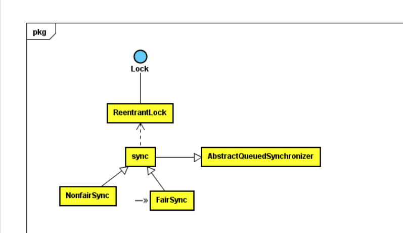

## ReentrantLock 详解
>ReentrantLock是可重入锁（同一个线程重复获取锁是可以成功的),锁的获取都是独占式的。

#### ReentrantLock 源码解析
##### 数据结构
```
public class ReentrantLock implements Lock, java.io.Serializable {
	···
	private final Sync sync;
	···
	public ReentrantLock() {
        sync = new NonfairSync();
    }
}
```
类图结构如下：</br>
</br>
ReentrantLock内部聚合一个Sync,Sync用于锁的获取与释放。内部的公平锁与非公平锁是用NonfairSync与FairSync实现.默认是非公平实现。

##### ReentrantLock.lock() 获取锁
```
    public void lock() {
        sync.lock();
    }

    final void lock() {
    	//修改同步状态
        if (compareAndSetState(0, 1))
            setExclusiveOwnerThread(Thread.currentThread());
        else
            acquire(1);
    }
```
lock()先尝试一次修改同步状态，如果成功，设置锁的占用线程是当前的线程。否者调用acquire(1)</br>
acquire()是AQS的模板方法。先尝试获取锁，成功则返回。不成功添加到等待队列，然后循环等待直到获取成功。</br>
Sync实现重写tryAcquire()尝试获取同步状态方法
```
    protected final boolean tryAcquire(int acquires) {
            return nonfairTryAcquire(acquires);
    }

   final boolean nonfairTryAcquire(int acquires) {
        final Thread current = Thread.currentThread();
        int c = getState();
        // c==0,同步状态还没有被其他线程占用
        if (c == 0) {
            if (compareAndSetState(0, acquires)) {
            	//设置当前锁的占用线程
                setExclusiveOwnerThread(current);
                return true;
            }
        }
        //占用线程是当前线程，累加同步状态，表示重入
        else if (current == getExclusiveOwnerThread()) {
            int nextc = c + acquires;
            if (nextc < 0) // overflow
                throw new Error("Maximum lock count exceeded");
            setState(nextc);
            return true;
        }
        return false;
    }    
```
tryAcquire()如果当前锁没有被占用，或者占用线程就是当前的线程，同步状态设置成功，返回true,否者返回false.

##### ReentrantLock.unlock()释放锁
```
    public void unlock() {
        sync.release(1);
    }

    //只有释放了同一个线程占用的所有的锁，才返回成功。
    protected final boolean tryRelease(int releases) {
        int c = getState() - releases;
        if (Thread.currentThread() != getExclusiveOwnerThread())
            throw new IllegalMonitorStateException();
        boolean free = false;
        if (c == 0) {
            free = true;
            setExclusiveOwnerThread(null);
        }
        setState(c);
        return free;
    }
```

##### ReentrantLock.lockInterruptibly() 获取锁，可响应中断
```
    public void lockInterruptibly() throws InterruptedException {
        sync.acquireInterruptibly(1); //AQS模板实现
    }

```

##### ReentrantLock.tryLock(long timeout, TimeUnit unit)超时获取锁，可中断
```
    public boolean tryLock(long timeout, TimeUnit unit)
            throws InterruptedException {
        return sync.tryAcquireNanos(1, unit.toNanos(timeout)); //AQS模板方法实现
    }
```
---
>ReentrantLock默认是非公平锁，即获取锁的顺序不是按照先获取先得到，而是抢占式地获取。公平锁按照线程申请锁的顺序依次获取锁。ReentratnLock的公平实现是FairSync

##### 公平获取锁实现
```
    final void lock() {
        acquire(1);
    }

    protected final boolean tryAcquire(int acquires) {
        final Thread current = Thread.currentThread();
        int c = getState();
        if (c == 0) {
            if (!hasQueuedPredecessors() &&
                compareAndSetState(0, acquires)) {
                setExclusiveOwnerThread(current);
                return true;
            }
        }
        else if (current == getExclusiveOwnerThread()) {
            int nextc = c + acquires;
            if (nextc < 0)
                throw new Error("Maximum lock count exceeded");
            setState(nextc);
            return true;
        }
        return false;
    	}
    }
```
公平获取锁的与非公平的差别是，直接调用acquire(int),非公平锁先尝试一次获取锁，获取成功就占用。尝试获取锁时，先判断是否还有前一个节点...

---

#### ReentrantLock总结
+ ReentrantLock实现是基于AQS的
+ 实现可重入是在当前的线程基础上状态+1