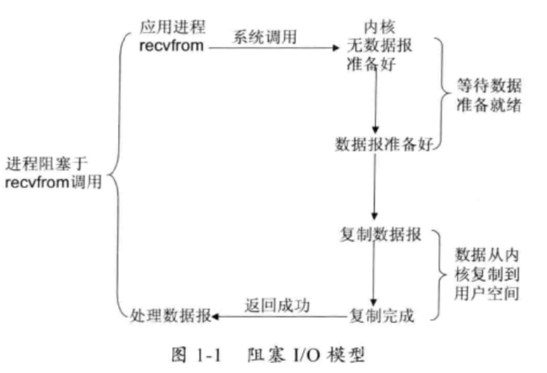
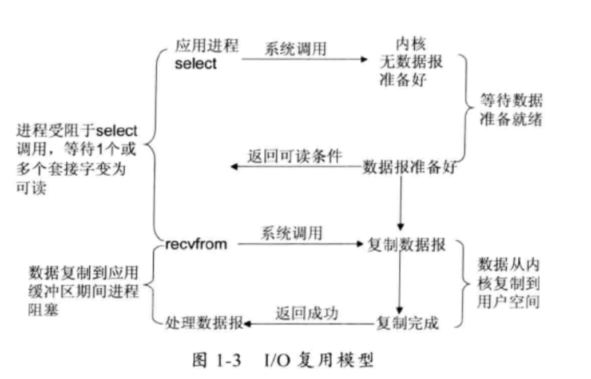
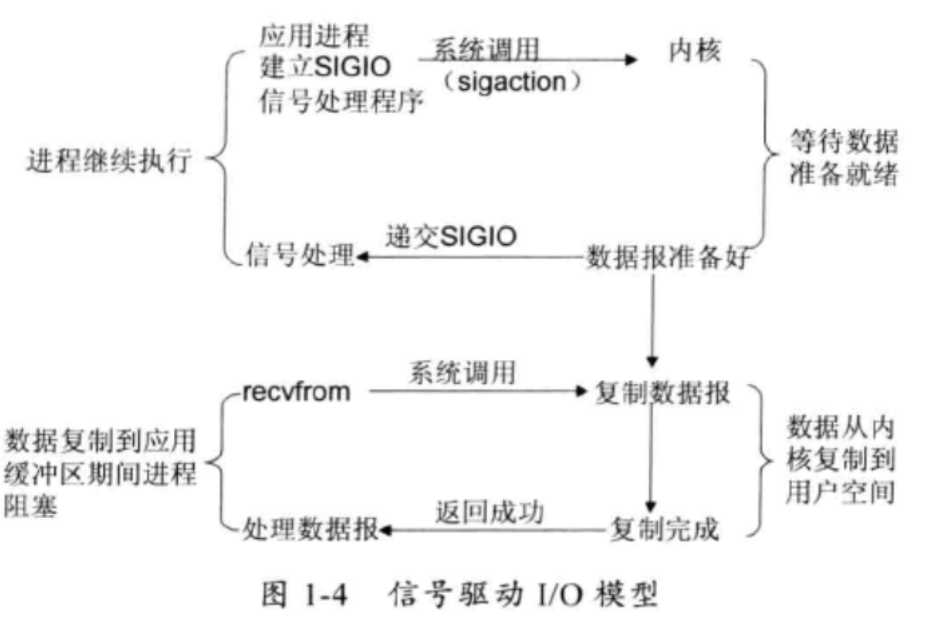
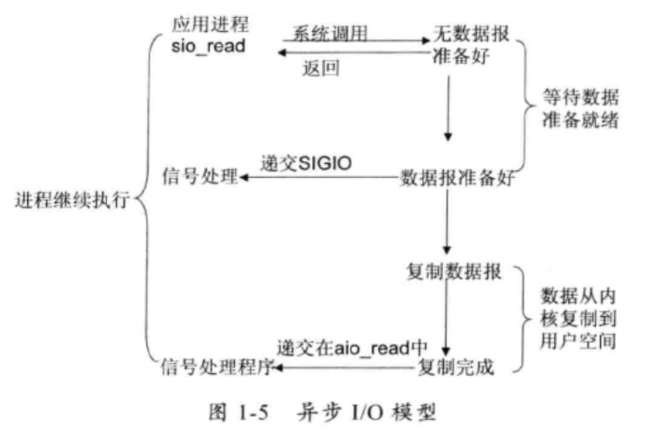

## 通信扫盲

#### Linux支持的I/O模型
*  阻塞IO:进程调用recvfrom,其系统调用直到数据包到达且被复制到应用程序的buffer中或者发生错误才会返回，在此期间一直等待。

*  非阻塞IO:进程调用recvfrom，如果此时数据没有准备就绪就返回一个EWOULDBLOCK错误。进程轮询这个状态信息查看数据是否准备就绪。

*  I/O复用：把多个I/O阻塞复用到一个Select或poll系统调用，实现单线程情况下同时可以处理多个请求

*  信号驱动I/O：开启信号驱动IO功能，通过调用sigaction执行信号处理函数。当系统准备就绪，系统调用生成一个SIGIO信号，通过信号回调通知应用程序来读取数据
 
*  异步I/O：告知内核启动某个操作，并让内核在整个操作完成后通知应用程序
 

#### Linux 多路复用实现技术

select :select 函数监视的文件描述符分3类，分别是writefds、readfds、和exceptfds。调用后select函数会阻塞，直到有描述符就绪（有数据 可读、可写、或者有except），或者超时（timeout指定等待时间，如果立即返回设为null即可），函数返回。当select函数返回后，可以通过遍历fdset，来找到就绪的描述符。
    
    限制：单个进程所打开的FD是有一定限制的，它由FD_SETSIZE设置，默认值是1024  
         对socket进行扫描时是线性扫描，即采用轮询的方法，效率较低  
poll:，它将用户传入的数组拷贝到内核空间，然后查询每个fd对应的设备状态，如果设备就绪则在设备等待队列中加入一项并继续遍历，如果遍历完所有fd后没有发现就绪设备，则挂起当前进程，直到设备就绪或者主动超时，被唤醒后它又要再次遍历fd。这个过程经历了多次无谓的遍历。
    
    限制：大量的fd的数组被整体复制于用户态和内核地址空间之间，而不管这样的复制是不是有意义。  
          poll还有一个特点是“水平触发”，如果报告了fd后，没有被处理，那么下次poll时会再次报告该fd。  

epoll:epoll支持水平触发和边缘触发，最大的特点在于边缘触发，它只告诉进程哪些fd刚刚变为就绪态，并且只会通知一次。还有一个特点是，epoll使用“事件”的就绪通知方式，通过epoll_ctl注册fd，一旦该fd就绪，内核就会采用类似callback的回调机制来激活该fd，epoll_wait便可以收到通知。

#### 总结

阻塞/非阻塞:阻塞是说请求开始之后，需要一直等到响应才可以进行接下来的工作。非阻塞是请求开始之后，无需等待响应便可以做其他操作。
同步/异步：同步是对结果的获取，只有结果准备就绪才做其他操作。异步是对结果的获取失败时，可以先做其他操作。等系统调用完成了处理，通过信号(事件驱动模型)来通知应用做处理。