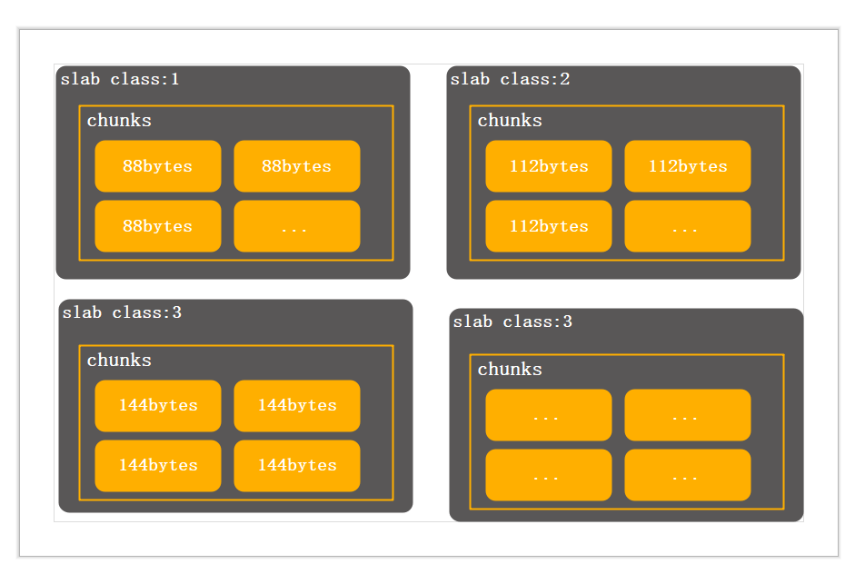
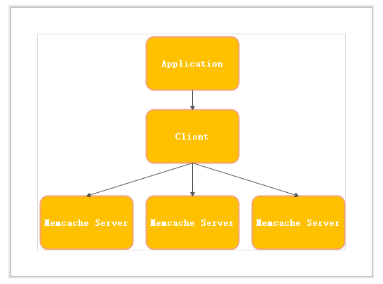
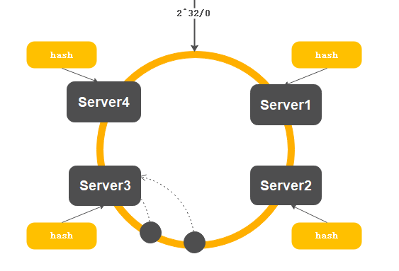

## Memcache工作原理

#### 内存管理 Slab Allocation

** memcached 内存申请 **

memcache开始申请空间，以page(默认1M大小)为单位，申请后将这个page的内存切分成同样大小的chunk,每一个chunk就是存放数据的地方。同样大小的chunk组成一个slab_class。slab增长的大小是通过增长因子决定的，默认是1.25。

当需要存一个value,回去匹配slab_class中的chunk的大小选择最适合的大小的chunk

** memcached 内存回收方式 **

memcache使用LRU算法管理内存，将失效的缓存数据清理,或者最近最少使用算法。memcached并不会主动去检测过期的数据，在每次get时检测时间戳，失效不返回数据且标注过期，新数据可以覆盖。

#### Memcache分布式

memcached(服务器进程名称) 本身并不支持分布式。分布式是由客户端实现。保存一个key，客户端通过key路由memcached服务器。memcached之间不通信

**分布式算法(一致性哈希算法)**

memcacheed的分布式算法是通过客户端来实现，客户端根据请求的key决定存入或者读取的服务器，服务器之间互不联系。客户端采用的分布式算法是一致性hash算法。先算出memcached服务器节点的散列值，并将其分配到0-2^32次方的圆上，然后计算key的散列值，顺时针找到第一台服务器。超过2^32次key,放在第1台服务器上。

#### Memcache线程管理

memcached是单进程多线程模型，用libevent处理请求。主进程负责将新来的连接分配给work线程，work线程负责处理连接，有点类似与负载均衡，通过主进程分发到对应的工作线程.

