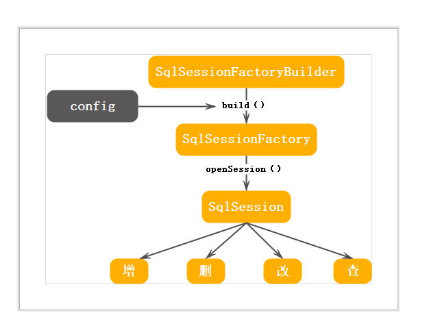

## MyBatis源码解析(一): 初始化

使用MyBatis提供的接口增删改查之前需要先取得SqlSession, 而SqlSession由SqlSessionFactory得到。SqlSessionFactory又由SqlSessionFactoryBuilder创建。



MyBatis配置信息：
```
<?xml version="1.0" encoding="UTF-8" ?>
<!DOCTYPE configuration
  PUBLIC "-//mybatis.org//DTD Config 3.0//EN"
  "http://mybatis.org/dtd/mybatis-3-config.dtd">
<configuration>
    <properties resource="jdbc.properties"></properties>

    <settings>
        <!-- 开启全局性设置懒加载 -->
        <setting name="lazyLoadingEnabled" value="true" />
        <!-- 开启按需加载 -->
        <setting name="aggressiveLazyLoading" value="false" />
    </settings>

    <environments default="development">
        <environment id="development">
            <transactionManager type="JDBC" />
            <dataSource type="POOLED">
                <property name="driver" value="${jdbc.driver}" />
                <property name="url" value="${jdbc.url}" />
                <property name="username" value="${jdbc.username}" />
                <property name="password" value="${jdbc.password}" />
            </dataSource>
        </environment>
    </environments>
    <mappers>
        <mapper resource="mapper/BookCURDMapper.xml" />
        <mapper resource="mapper/PublishingCompanyMapper.xml" />
        <mapper resource="mapper/BookDynamicMapper.xml" />
    </mappers>
</configuration>
```
其中包括
 properties/settings/environments/mappers等标签。配置信息在MyBatis内部用Configuration表示。xml的配置信息用XMLConfigBuilder解析。
 ```
     XMLConfigBuilder parser = new XMLConfigBuilder(inputStream, environment, properties); 
     parser.parse();   //解析返回一个Configuration
 ```

