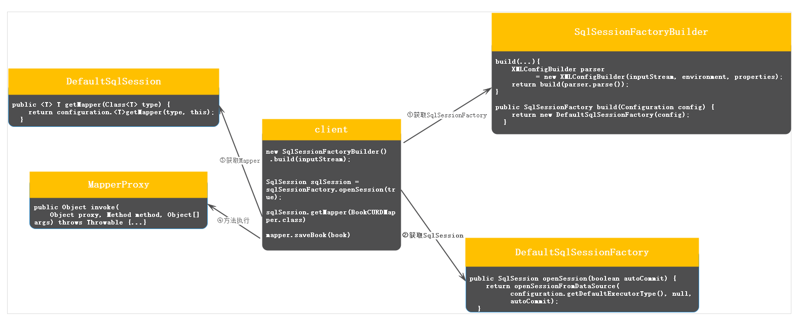

## mybatis源码解析(一)：整体执行流程

在mybatis中，执行一个方法的整体流程分为几个步骤

1. get SqlSessionFacctory:读取配置文件封装成Configuration,返回要给DefaultSqlSessionFactory。
2. get SqlSession：DefaultSqlSessionFactory根据已经封装的Configuration封装一个DefaultSqlSession
3. get Mapper: 返回一个代理对象
4. 'mapper'方法执行：通过代理对象执行方法
5. 获得结果

整体流程示意图:

