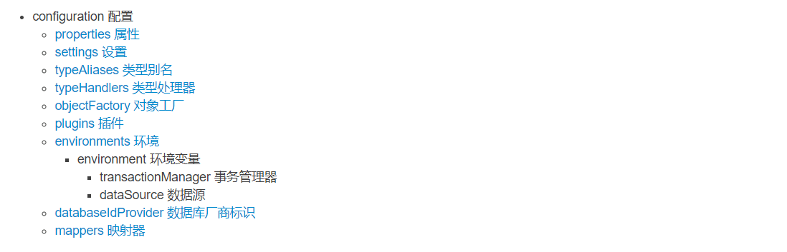

## mybatis源码解析(二) : 获取SqlSessionFctory  

SqlSessionFctory是获取SqlSession的工厂，提供各种获取SqlSession的方法:

```
public interface SqlSessionFactory {

  SqlSession openSession();

  SqlSession openSession(boolean autoCommit);
  SqlSession openSession(Connection connection);
  SqlSession openSession(TransactionIsolationLevel level);

  SqlSession openSession(ExecutorType execType);
  SqlSession openSession(ExecutorType execType, boolean autoCommit);
  SqlSession openSession(ExecutorType execType, TransactionIsolationLevel level);
  SqlSession openSession(ExecutorType execType, Connection connection);
7
  Configuration getConfiguration();
}
```

mybatis-cofnig.xml的配置信息由Configuration表示。全局的配置信息包含:



对应的Configuration表示：


**mapper映射器解析**

mappers映射器对应生成的mapper在MapperRegistry注册。MapperRegistry：
```
public class MapperRegistry {
    ...
    private final Configuration config;
    private final Map<Class<?>, MapperProxyFactory<?>> knownMappers = new HashMap<Class<?>, MapperProxyFactory<?>>();
    ...
}
```

mapper配置方式可以有多种：
```
<configuration>
    ...
    <!-- 使用相对于类路径的资源引用 -->
    <mappers>
        <mapper resource="mapper/BookCURDMapper.xml" />
    </mappers>

    <!-- 使用完全限定资源定位符（URL） -->
    <mappers>
      <mapper url="file:///var/mappers/AuthorMapper.xml"/>
    </mappers>

    <!-- 使用映射器接口实现类的完全限定类名 -->
    <mappers>
      <mapper class="org.mybatis.builder.AuthorMapper"/>
    </mappers>

    <!-- 将包内的映射器接口实现全部注册为映射器 -->
    <mappers>
      <package name="org.mybatis.builder"/>
    </mappers>
    ...
</configuration>
```

* package
```
 public void addMappers(String packageName) {
    addMappers(packageName, Object.class);
}

 public void addMappers(String packageName, Class<?> superType) {
    ResolverUtil<Class<?>> resolverUtil = new ResolverUtil<Class<?>>();
    resolverUtil.find(new ResolverUtil.IsA(superType), packageName);
    Set<Class<? extends Class<?>>> mapperSet = resolverUtil.getClasses();
    for (Class<?> mapperClass : mapperSet) {
      addMapper(mapperClass);
    }
}
```
解析package属性，是将package下的所有class类作为注册的class添加到mappe


* url
* class
* resource

```
 private void mapperElement(XNode parent) throws Exception {
    ...
    if (resource != null && url == null && mapperClass == null) {
        ErrorContext.instance().resource(resource);
        InputStream inputStream = Resources.getResourceAsStream(resource);
        XMLMapperBuilder mapperParser = new XMLMapperBuilder(inputStream, configuration, resource, configuration.getSqlFragments());
        mapperParser.parse();
    }
    ...
 }
```
解析交由XMLMapperBuilder：
```
public class XMLMapperBuilder extends BaseBuilder {
  ...
  private final XPathParser parser;
  private final MapperBuilderAssistant builderAssistant;
  private final Map<String, XNode> sqlFragments;
  private final String resource;
  ...
}
```

对于select | insert | update | delete  语句的解析交给XMLStatementBuilder
```
public class XMLStatementBuilder extends BaseBuilder {
    ...
    private final MapperBuilderAssistant builderAssistant;
    private final XNode context;
    private final String requiredDatabaseId;
    ...
}
```


