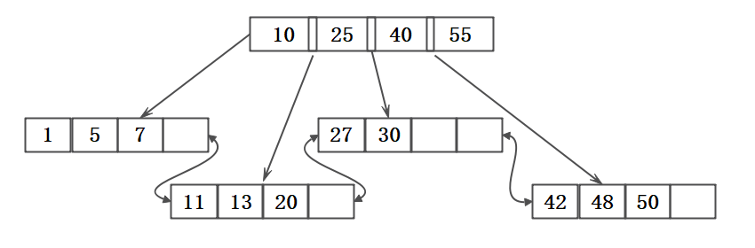
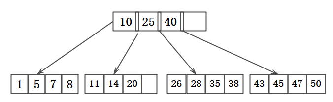
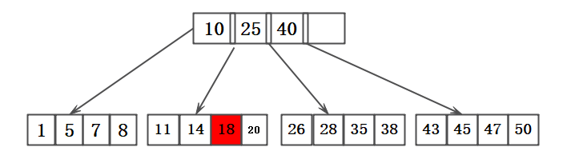
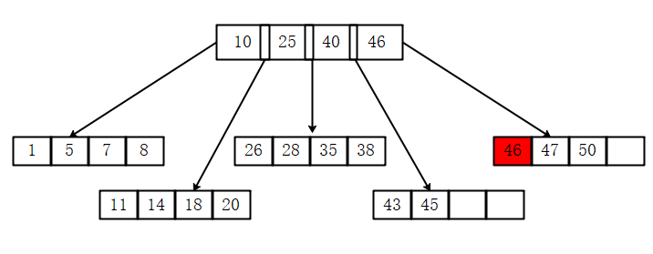
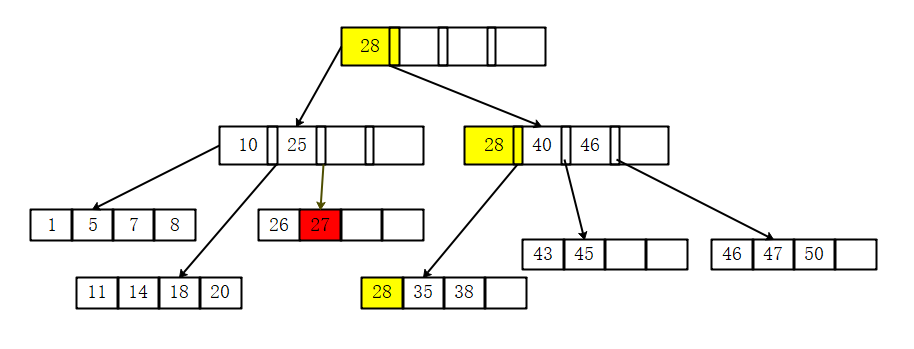
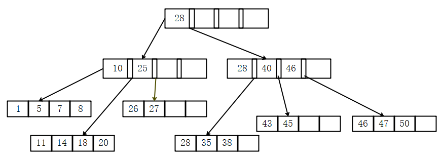
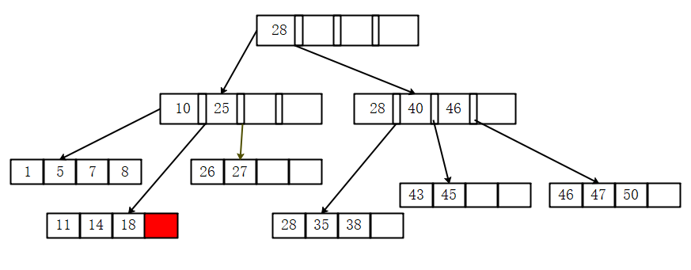
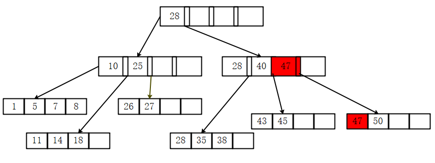
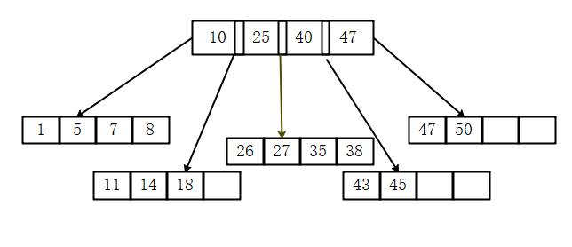

## mysql索引(一): 数据结构

#### B+树

**B+树特点：**  
B+树中的B代表的是Balance,是一颗平衡查找树  
B+树中的数据都按顺序存在叶子节点中，且各个叶子节点有指针相连 

**B+树操作：**

* 插入操作:插入之后树还需要保持顺序以及平衡，分为以下几种情况
     
    1. Leaf Page Full = NO, Index Page Full = NO :  直接插入
    2. Leaf Page Full = YES, Index Page Full = NO: ①拆分LeafPage，②将中间节点放入IndexPage中，③节点放置(左<中<右)
    3. Leaf Page FULL = YES, Index Page Full = YES:①拆分LeafPage,②节点放置(左<中<右),③拆分IndexPage，④节点放置(左<中<右),⑤添加一层IndexPage

    

    插入示例(省略叶子节点间的指针)： 
     
    
    插入18元素，Leaf Page Full = NO, Index Page Full = NO(省略叶子节点间的指针)： 
     

    插入46元素,Leaf Page Full = YES, Index Page Full = NO(省略叶子节点间的指针): 
    拆分LeafPage选择中间节点，插入的顺序 43,35,46,47,50,中间节点为46  
    

    插入元素27,Leaf Page FULL = YES, Index Page Full = YES(省略叶子节点间的指针): 
    

* 删除操作：B+树使用填充因子（fill factor）来控制树的删除变化，50%是填充因子可设的最小值。删除之后B+树还需要保持平衡，分为以下几种情况:
    
    
    1. Leaf Page Below Fill Factory = No, Index Page Below Fill Factor = No:直接删除，如果该节点还是IndexPage,则用该节点的右节点代替
    2. Leaf Page Below Fill Factory = Yes, Index Page Below Fill Factor = No:合并叶节点及其兄弟节点，同时跟新IndexPage
    3. Leaf Page Below Fill Factory = Yes, Index Page Below Fill Factor = Yes:合并IndexPage及兄弟节点
    
    

    删除示例(省略叶子节点间的指针)： 
    

    删除20,Leaf Page Below Fill Factory = No, Index Page Below Fill Factor = No(省略叶子节点间的指针)： 
    

    删除46,Leaf Page Below Fill Factory = No, Index Page Below Fill Factor = No,如果该节点还是IndexPage,则用该节点的右节点代替(省略叶子节点间的指针)： 
    

    删除28,Leaf Page Below Fill Factory = Yes, Index Page Below Fill Factor = Yes: 
     

**B+树分裂：**  
插入时可能引起B+树的分裂，在B+树中从顺序排列的节点的中间位置分裂，但是MySql中按照这个方法可能会引起页的不可用(叶子节点是页)，例如1，2，4，5中插入3，是需要在4之前的位置分裂，这会引起p1(1,2)之后的位置不可用造成空间浪费。所以mysql中的逻辑是(Innodb引擎)：在页的Page Header部分记录PAGE_LAST_INSERT,PAGE_DIRECtION，PAGE_N_DIRECTION参数。通过这些信息，InnoDB决定引擎是向右还是向左分裂，同时决定将分裂点记录为哪一个。如果插入的元素是随机的，分裂点在页的中间。如果往同一方向进行插入的记录数量为5，并且已经定位到的记录之后还有3条记录，则分裂点的记录为定位到的记录的第三天记录，否者分裂点记录就是待插入的记录。

#### 哈希算法 TODO