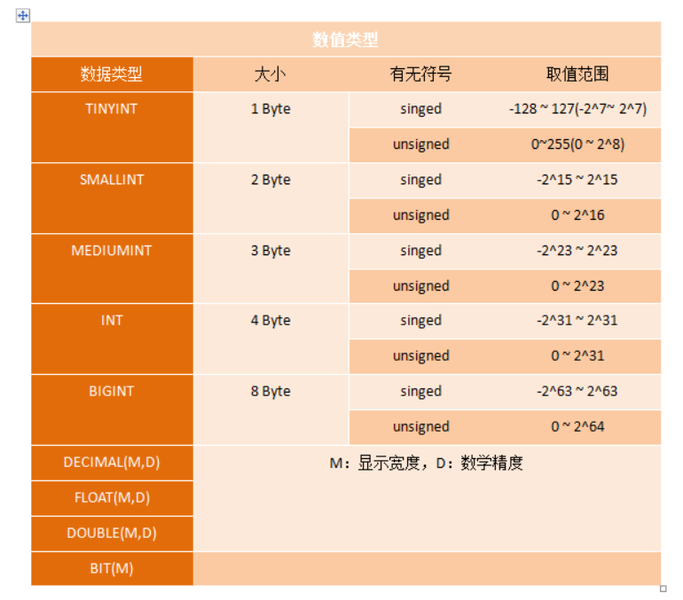
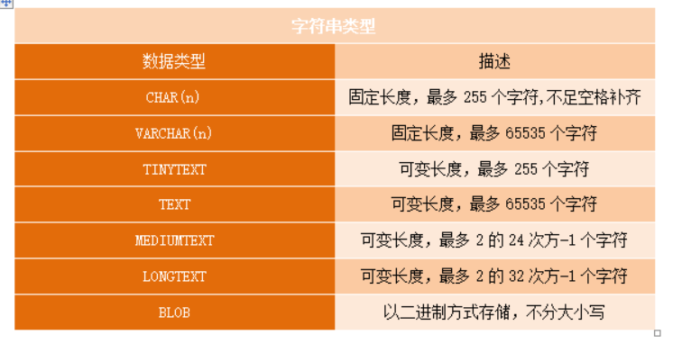
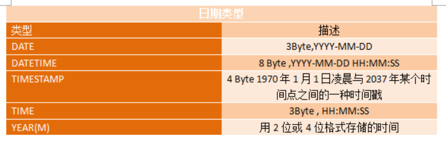

## MySQL 数据类型

**mysql支持的数据类型:**  
数值类型:

精确类型的数据类型包含整型以及Decimal。整行上加上M影响的只是显示的长度，并不影响真正存储的长度。Deciaml是定点类型，有个固定小数，不会四舍五入。Decimal定义为UNSIGNED并不会增加范围，只是没有了负数部分。Deciaml的M，D都可以省略，M有效位数，默认10，D小数位数,默认0。 
FLOAT & DOUBEL存储近似值。 
ZIROFILL 数值类型用于填充若干个0用以达到显示宽度。

字符串类型：

blob是二进制大对象，可以存储任意大小的二进制内容  
text存储的是字符串，与字符和排序规则相关联0

日期类型：

