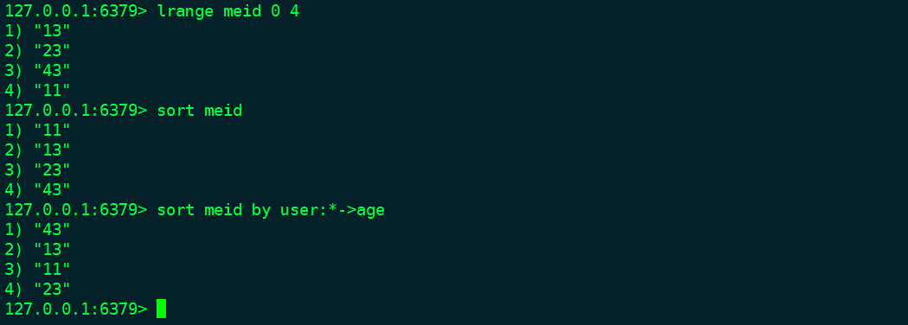
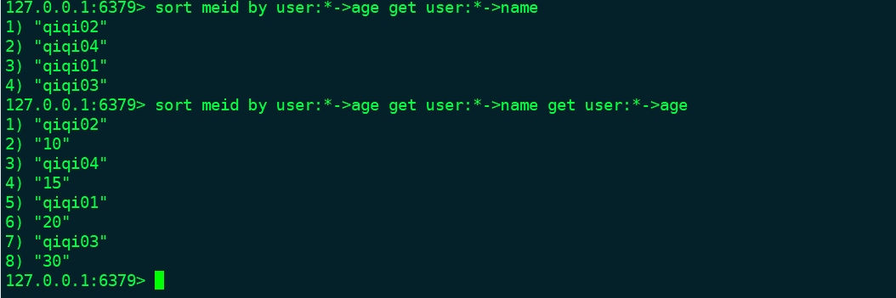
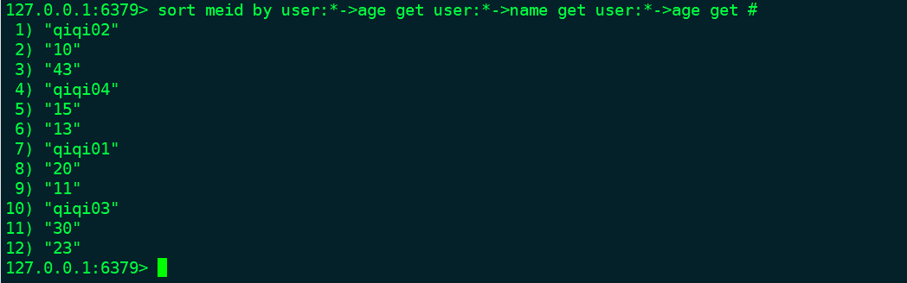

## 其他功能

#### redis事物支持

* 支持事物命令
```
    multi
        command 1
        command 2
    exec
```
在muli/exec中的命令要么都执行，要么都不执行。执行过程时，multi命令发送后，command 1, command 2命令发送后不是立即执行，而是放在等待执行的队列里。exec发送后才执行队列里的命令。其中可能出现的错误情况：

1. 语法错误，命令的语法错误可以立即被检查，exec命令发送之后直接返回错误，所有命令都不执行。
2. 运行时错误，正确的命令都会执行，错误的命令不执行。redis事物不带有rollback功能

* watch 命令
```
    watch key...
```
watch命令的作用是监视key,如果key被修改那么事物就不会被执行。监视直到exec结束

#### redis过期设置

* 过期时间设置
```
    expire key seconds      设置过期时间(秒)
    pexpire key millseconds 设置过期时间(毫秒)
    persist key             永久存在，没有设置过期时间的key默认永久存在
    ttl  key                查看过期时间，永久存在-1
```

#### 排序
```
    sort key                可以对列表，集合排序
    alpha/desc..            可以在sort命令结尾加上排序规则
    sort key by 参考键       参考键是某个字符串类型键或者散列类型中的某个字段(键名->字段名)

```

上图通过user:id下的age作为参考键排序

* 排序后get 

* get id

* 排序后结果保存
```
    store key
```