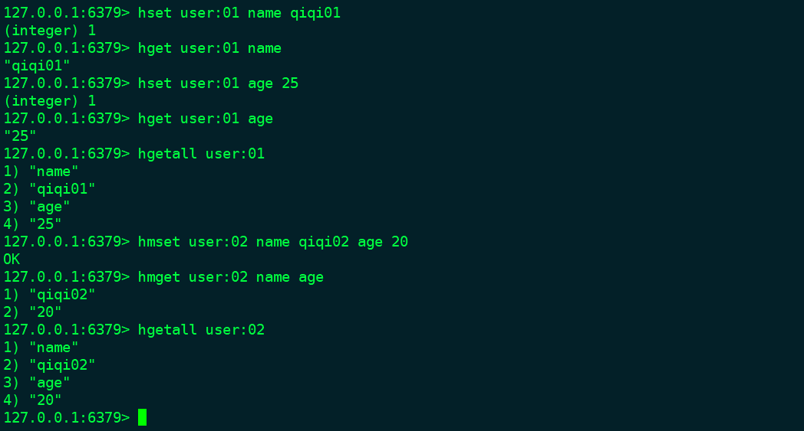

##redis基本使用(三):hash
>hash中的值是一个key-value结构，其中value只能是字符串。一个hash类的键最多包含2^32-1个字段。

* 赋值/取值
```
    hset key field value        单个字段赋值
    hget key field              单个字段取值
    hmset key field value field value 多个字段赋值
    hmget key field field...          多个字段取值
    hgetall key                       所有值取值
    hsetnx key field value       field不存在时赋值，存在不操作
```


* 字段是否存在
```
    hexists key field

    --> 0-不存在，1-存在
```

* 数字操作
```
    hincrby key field n        value + n
```

* 删除字段
```
    hdel key field...
```

* 字段名/字段值获取
```
    hkeys key            取得字段值
    hvals key            取得字段名
    hlen  key            字段数量
```