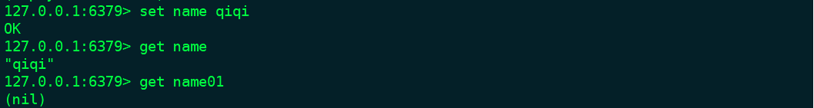

## redis基本使用(二):字符串

>String中存储的除了可以是一个字符串，还可认为是一个数字(如果可以转成数字的话)

* 单个键赋值/取值
```
    set key value     赋值
    get key           取值，空返回(nil)
```


* 数字操作
```
    incr key          value + 1，key不存在则 0+1，整数
    incrby key n      value + n，key不存在则 0+n，整数
    decr key          value - 1, key不存在则 0-1，整数
    decrby key n      value - n, key不存在则 0-n，整数
    incrbyfloat key n value + n, key不存在则 0+n，浮点数
    decrbyfloat key n value - n, key不存在则 0-n，浮点树
```

* 追加
```
    append key value
```

* 字符串长度
```
    strlen key
```

*多个键赋值/获取
```
    mget key1 key2...
    mset key1 value1 key2 value2...
```


#####redis内部string实现
Redis内部不是用C语言的字符串格式保存字符串，Redis实现了自己的字符串格式SDS(simple dynamic string)。
```
struct sdshdr{
    int len;  //字符串长度
    int free;   // 未使用字节数量
    char buf[]; //存储字符串内容
}
```
为什么使用SDS？
1. 效率：SDS获取长度是直接获取len的值O(1)，比C的length快O(n); Redis的字符串内存分配，追加操作使用内存预分配以及惰性空间释放来减少操作字符串修改时带来的内存重分配次数
2. 安全：SDS是根据记录的len防止内存溢出的问题。C的API没有这个校验，容易内容溢出。
3. 灵活（二进制安全）：SDS可以存储任意格式的二进制数据,是根据len来决定到哪里数据结束，SDS API是以二进制方式处理SDS存放在buf数组里的数据，没有限制。C只能存储文本数据，结尾是义'\0'表示，所以C字符串中不能插入'\0'这样的字符。
4. 兼容部分的C字符串函数
SDS内存分配策略:
1. 内存预分配：当操作的是字符串的增长操作，先判断是否有足够的空间保存将要增长的数据。如果没有，内存增长的策略是，当增长后的内存不操作1M，增长后的空间len = free,增长后的空间就是 all = len + free + 1(最后存储一个'\0');如果增长后的内存超过1M，则每次增长后，free = 1M。
2. 惰性空间释放：当操作的是字符串缩短操作，释放掉的空间不是在内存上直接释放，只是修改len与free的值。减少内存分配次数
</div>