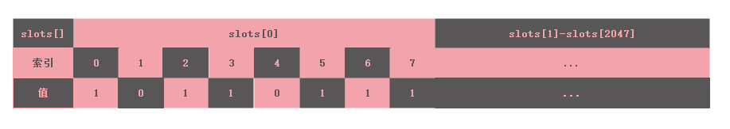
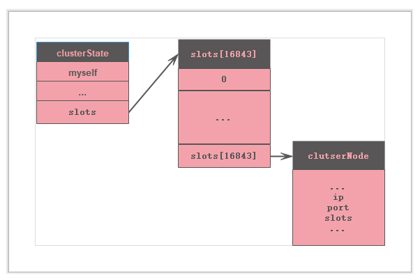

## redis 集群

#### redis 集群
单机的性能与内存都有限，通过集群可以方便地扩展访问吞吐量以及内存。</br>
redis集群搭建配置：
```
    port 9001（每个节点的端口号）
    daemonize yes
    bind 192.168.119.131（绑定当前机器 IP）
    dir /usr/local/redis-cluster/9001/data/（数据文件存放位置）
    pidfile /var/run/redis_9001.pid（pid 9001和port要对应）
    cluster-enabled yes（启动集群模式）
    cluster-config-file nodes9001.conf（9001和port要对应）
    cluster-node-timeout 15000
    appendonly yes
```
<font color='#CD6155' size="4.5">集群原理：</font><br>

redis集群是通过数据分片实现根据根据数据的key分配到不同的master服务器的slot中。redis集群中共有16384个slot。连接到集群的master服务器分别管理这16384个slot的一部分。这种方式实现集群容易水平扩展服务节点以及删除节点，只需要在节点添加之后reshark切片或者删除之前将将要删除的node管理的slot重新分配给正在工作种的其他服务器，然后删除节点便可以。<br>
<font color="#CD6155">**只有16384个slot都被管理，集群才是正常工作**</font>
<font color="#CD6155">**cluster工作模式只接受单个key的操作，原因是不同的key分布在不同的slot中，不同的slot可在不同的服务器上**</font>


集群中的任何一个节点管理的包含slot信息，其他节点信息的实现：

1. 自身管理哪些slot? <br>
节点自己管理的slot信息放在一个char slots[16384/8]数组中,0-7号节点在slots[0]中记录，8-14在slots[1]上记录，以此类推。结构示意图：

值 = 1 才是自己管理的slot号。通过要给slots数组，可以很方方便地找到给定地slot索引是不是自己管理的

2. 一个key是否是属于自己管理的slot?<br>
key对应的slot的计算方法CRC(16)&key得到对应的slot的索引值
3. 不是自己的slot那是需要转给谁？<br>
如果不是自己的slot需要转给其他的节点，需要知道集群中其他节点的地址信息以及对应的管理的slot信息。这些信息在节点中保存的方式是：<br>
 <br>
在每一个节点上都保存了一个clusterState包括节点自身的信息以及其他节点的一些信息。其中slots与clusterNode中的节点不是同一个slots，这个slots数组保存了0-16384个slot对应的全部节点信息，包括对应的ip地址，端口信息等。通过这个接口就可以很方便知道是节点是否是属于自己管理，以及其他slot索引对应的节点信息。

<font color="#CD6155">**QUE: 集群工作做的服务器如何得到其他node的信息？**</font>
node间通信会将自己管理的slot信息发送给其他节点。其他节点接收到信息便保存下来。

#### 故障转移
**故障检测**集群中的node是通过PING-PONG来互相通信。当A node 发送ping给B，B超过time-out没有发送pong的消息给A，A就标记B为PFAIL(probable fail)。当A标记B为PFAIL(probable fail)之后，A node将B的下线信息封装成fail_report随FAIL消息发送。当集群中超过半数以上的node认为B PFAIL，那么A将B node设为FAIL，并广播这个消息。其他节点将B的状态设置为FAIL <br>
**故障转移**B的slave node收到A的FAIL信息之后。选举一个slave作为代替B的master <br>
**slave选举**当slave发送自己的master下线，会广播一条CLUSTERMSG_TYPE_FALLOVER_AUTH_REQUREST消息给其他的master,master在同一个配置纪元中有一次投票机会。收到大于半数的master回复CLUSTERMSG_TYPE_FALLOVER_AUTH_ACK消息的slave成为master。新的master发送PONG消息通知其它node自己成为master。<br>

故障转步骤总结：

1. 下线的master的slave有一个节点被选中
2. 被选择的slave node 会执行slaveof on one命令，成为新的master
3. 新的master撤销对所有下线的节点的slot指派，并将指派都指给自己
4. 新的master发送PONG通知其他节点，自己成为master
5. 新的master开始工作 

#### gossip通信
gossip是集群中节点间的通信协议。通信类型分为5类：<br>

**MEET:** 请求加入集群<br>
**PING:** 检测节点是否在线，每个1秒选择5个最久未通信节点<br>
**PONG:** 回应MEET/PING，表示已经收到。同时作为广播，其他节点会刷新节点设置<br>
**FAIL:** 判断下线消息<br>
**PUBLISH:** <br>


