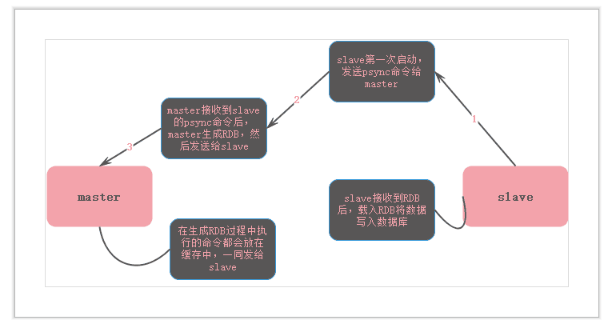

#### redis 主从架构

<font color='#CD6155' size="4.5">单台服务器可能出现什么问题？</font><br>
* 单台服务器在单机故障时，会导致整个服务不可用,数据丢失<br>

```
为了避免在单台服务器上发生单点故障造成数据丢失以及服务器不可用，redis提供了主从架构的配置。
主从架构中的服务器分为主服务器(master)和从服务器(slave)。
在master上的数据在slave中都有备份，且master的更新(插入，删除，更新)都会同步到slave中。在简单的应用中，配置主从便可
```
* 单机服务器会有瓶颈，最好的情况下单台机器到10w QPS(实际上应该达不到这个值)
```
    主从架构 -> 读写分离 ->水平扩展 -> 突破单机访问瓶颈
```

<font color='#CD6155' size="4.5">从服务器配置：</font><br>
```
    slaveof <masterip> <masterport> 
```

<font color='#CD6155' size="4.5">主从架构原理：</font><br>
slave第一次启动，给主服务器发送PSYNC请求同步(第一次启动时完整重同步)。完整同步完成后，master将缓存区的数据也发给slave，slave写入完成全量同步。之后每一次主数据的写操作，异步发送给slave。

slave从master复制数据式通过发送PSYNC开始的，PSYNC分为完整重同步(full resynchronization)和部分重同步(partial resynchronization)执行模式

<font color='#CD6155'>什么时候完整重同步？什么时候部分重同步？</font><br>
当salve服务器第一次启动，向主服务器发送PSYNC命令，此时完整重同步。当连接中断，使用部分重同步。部分重同步是根据copy_offset以及服务器ID来标识。

<font color='#CD6155'>如何完整重同步？如何部分重同步？</font><br>
*完整重同步：*slave上线后，发送PSYNC命令给master，主服务器在后台生成一个RDB文件传给从服务器，从服务器根据RDB导入数据。在导入期间会有一部分新的数据在写入主服务器。这部分的数据复制是通过发送缓冲区里的命令来进行同步<br>


*部分重同步：*部分重同步主要处理断线后的重新复制。部分重同步是根据复制的偏移量来决定从哪里开始重新复制。还有一个问题需要解决的是，断线后发送PSYNC是需要完整重同步还是部分重同步？是根据复制积压缓存区来决定的。
复制积压缓存区是一个固定长度的FIFO队列(固定长度说明，当队列满了，再有一个元素进来的时候，会弹出第一个元素空出位置放最后一个进来的数据。)默认大小是1M。PSYNC命令的复制偏移量的后一个元素在队列中，那么是部分复制。否者就是完整复制。(br)
后续的数据一致性保持是通过服务器异步发送命令。


<font color='#CD6155'>PSYNC命令</font><br>
slave发送：<br>
1. slave是第一次复制，发送的是 PSYNC ? -1 命令
2. slave不是第一次复制，发送 PSYNC <runnid> <offset> 命令
master回复:<br>
1. FULLRESYNC <runid> <offset> 完整复制
2. +COUNTINUE 部分复制
3. ERR (PSYNC是redis 2.8才出现的命令)
---
1. salve的过期key处理。salve不存在处理过期key，当master处理过期key。会发del命令给slave. 
2. 几个配置说明
```
client-output-buffer-limit <class> <hard limit> <soft limit> <soft seconds>

client-output-buffer-limit normal 0 0 0
client-output-buffer-limit slave 256mb 64mb 60 //在复制期间，缓冲区持续消内存操作64MB，或一次性超过256MB，就复制失败
client-output-buffer-limit pubsub 32mb 8mb 60

```
client buffer是在server端实现的一个读取缓冲区。redis server在接收到客户端的请求后，把影响结果写入到client buffer中，而不是直接发送给客户端。server把结果写入到client buffer中后，继续处理客户端的其他请求。这样异步处理方式使redis server不会因为网络原因阻塞其他请求的处理
3.heartbeat:master/slave默认每10秒一次的频率发送心跳
4.全量复制有个(repl-timeout,复制操作超时)的限制