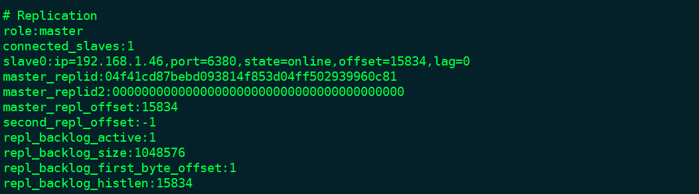

#### 哨兵集群 <br>
哨兵服务器的存在是为了提高主从架构的可用性。哨兵监视主从服务器，故障转移。哨兵即为了可用性，则哨兵服务器也需要保证可用性。所以哨兵需要集群复制(3个以上，这个数量在之后解释)<br>

哨兵配置
```
    bind 192.168.1.4                哨兵服务器的地址绑定
    port 5000                       哨兵服务器的端口，不可与redis服务器相同
    sentinel monitor mymaster 192.168.1.46 6379 2  sentinel监视的master服务器的名称，地址，端口号，quorum数量
    sentinel down-after-milliseconds <master-name> <milliseconds> 判断下线时间的范围，不同sentinel设置可以不同
    sentinel failover-timeout mymaster 180000  故障转移超时时间
    sentinel parallel-syncs mymaster 1         新的master选举成功后，其他slave挂到master的并发性。1就是1个1个挂接

```

一个哨兵可以监控多个master

哨兵启动
```
    redis-sentinel  sentinal.conf   启动命令
```

哨兵监控
```
    sentinel master mymaster  显示监视的服务器信息
    sentinel slaves mymaster  显示mymaster上的slave信息
    sentinel sentinel mymaster 显示监视同一个master的哨兵集群信息
```

<font color='#CD6155' size="4.5">哨兵原理：</font><br>
哨兵服务器启动后，会创建2个异步连接用于获取master服务器信息以及监测服务器工作状态。创建的连接分别是：<br>

1. 命令连接：向master发送命令，并接受命令回复
2. 订阅连接：订阅master的\__sentinel__:hello信息
哨兵服务器默认10秒中向服务器发送INFO命令，用于获取服务器的信息。服务器的回复信息中包含服务器运行的信息以及挂在master服务器下的slaves的信息(ip,port,offset等),这样sentinel既可知道master的信息，还可以自动感知slave的信息。

从master获取到slave服务器信息后，sentinel同样会建立2个异步连接用于获取slave的工作状态信息。

建立好连接后，sentinel会向所有的master和slave发送sentinel_hello信息(这个信息中包含sentinel自身的各种信息)，所有master和slave从订阅连接收到这个消息的同时，其他的sentinel也会接收到这个消息，这就可以知道除了自身之外的sentinel的存在。感知到其他sentinel存在之后，会建立连向这个sentinel的命令连接

<font color='#CD6155' >Sentinel与各种服务器通信：</font><br>
哨兵节点感知主服务信息是通过向master发送INFO命令，接收到的回复中包含的信息类似：

在INFO的回复中包含了slave节点的配置信息，这时候便可以知道该master下有哪些个slave存在。sentinel接收到这个信息后，同意会创建2个异步连接到slave节点。

哨兵节点通过命令连接和订阅连接向maseter/slave发送PUBLISH \__sentinel__:hello命令，其中带上自身的服务器信息。master/slave/其他sentinel收到这个消息，这个过程便可以感知监视同一个服务器的其他sentinel。建立命令连接。


<font color='#CD6155' size="4.5">检测服务器下线判断：</font><br>

服务器下线判断过程分为**主观下线->客观下线**<br>
*主观下线：*sentinel以每秒一次的频率向所有已经建立命令连接的server发送PING命令，在down-after-milliseconds之后都都没有收到目标服务器的正确回复，设置主观下线 <br>
*客观下线： *当某个sentinel标记主观下线后，会向其他sentinel发送询问命令，看该master是否真的已经下线。当收到>quorum的数量的服务器都回复确认下线，就标记为客观下线<br>

<font color='#CD6155' size="4.5">选举领头sentinel：</font><br>
领头sentinel的作用是选举新的master服务器。当服务器被判断为客观下线后，sentinel集群会选择一个领头sentinel用于选择一个slave作为master。<br>
领头sentinel的选举规则：<br>

1. 当sentinel标记master下线后，发送要求将自己标记为领头sentine命令。其中有current_epoch(当前选举计数器) 和 run_id（选举的领头服务器id）两个标记。
2. 当其他sentinel收到命令后，回复中含有current_epoch(当前选举计数器) 和 run_id（选举的领头服务器id）两个标记。如果是和发送服务器一致，说明该senntinel同意服务器成为领头。
3. 当发送者收到回复，超过一半以上的服务器都同意，那么领头选举成功。

其中有几点是：

1. 所有的sentinel都可以选举领头sentinel
2. 在一个current_epoch中，只可以设置一次，且先到先得。

<font color='#CD6155' size="4.5">故障转移：</font><br>

判断master客观下线，领头sentinel选举完成后，执行故障转移操作。故障转移的过程

1. 选择其中一个slave服务器提升为master
2. 给其他的slave发送从新的master复制的命令
3. 设置下线的master服务器作为新的master的slave 

<font color="#CD6155">**QUE 1：**</font> 选择哪一个slave作为master服务器？
master服务器选举步骤是：

1. 删除列表中所有下线的slave
2. 删除最近5秒内没有回复过INFO的slave
3. 删除所有下线的master
4. 选择剩下的slave列表中优先级最高的作为master
5. 如果有同样优先级的多个slave，选择复制偏移量最大的slave(在INFO中有返回)
6. 如果有同样优先级的多个slave，且offset一样，选择slave ID最小的一个服务器
7. 选完作为master的slave之后，发送slaveof on one，不让它作为任何节点的slave节点。把slave设置成master
8. master广播成为master的信息。


