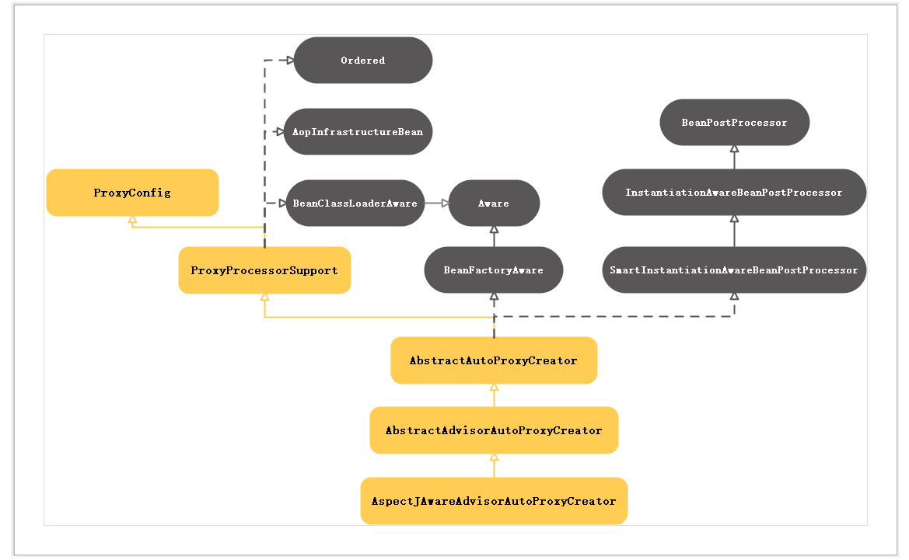
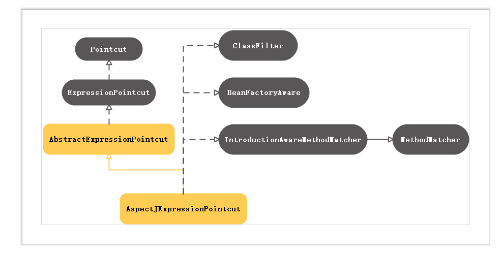
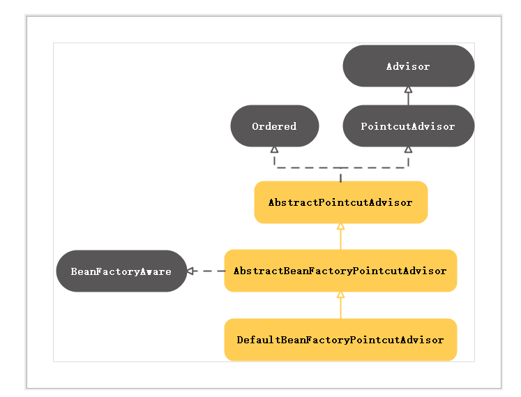
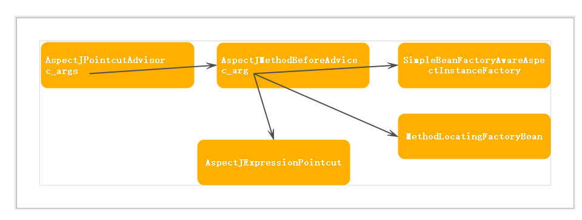

## AOP详解(一)：配置解析
>Spring提供AOP(Aspect Oriented Programming)。AOP关注横切面，增强目标方法。

* AOP相关术语：  <br>
**切面(Aspect):**横切关注点的模块化，是通知+切入点  <br>
**通知(Adivce):**定义做什么  <br>
**连接点(JoinPoint):**可以使用通知的地方  <br>
**切入点(PointCut):**真正使用通知的地方。 <br>
对应的Spring Bean
**Advice:**执行的动作 <br>
**Pointcut:**切入点  <br>
**Advisor:** advice + pointcut <br>

* AOP配置

```
    <!-- 横切关注点 -->
    <bean id="loggerAspect" class="pro.jing.aop.xmlschema.LoggerAspect"></bean>

    <bean id="cal" class="pro.jing.aop.aspectj.SimpleCalculatorImpl"></bean>

    <!-- aop配置 -->
    <aop:config>
        <aop:pointcut
            expression="execution( public int pro.jing.aop.aspectj.SimpleCalculatorImpl.*(..))"
            id="pointcut" />
        <!-- 横切关注点 -->
        <aop:aspect ref="loggerAspect">
            <!-- method:功能实现  pointcut-ref: 切入点-->
            <aop:before method="beforeMethod" pointcut-ref="pointcut" />
            <aop:after method="afterMethod" pointcut-ref="pointcut" />
            <aop:after-returning method="afterReturning"
                pointcut-ref="pointcut" returning="result" />
            <aop:after-throwing method="afterThrowing"
                pointcut-ref="pointcut" throwing="ex" /> 
        </aop:aspect>
    </aop:config>
```

##### 源码解析

(一)自定义标签解析器：

aop是自定义标签，通过hander初始化对应配置的解析器。
```
    http\://www.springframework.org/schema/aop=org.springframework.aop.config.AopNamespaceHandler

    public class AopNamespaceHandler extends NamespaceHandlerSupport { 
    @Override
    public void init() {
        registerBeanDefinitionParser("config", new ConfigBeanDefinitionParser());
        registerBeanDefinitionParser("aspectj-autoproxy", new AspectJAutoProxyBeanDefinitionParser());
        registerBeanDefinitionDecorator("scoped-proxy", new ScopedProxyBeanDefinitionDecorator());
        registerBeanDefinitionParser("spring-configured", new SpringConfiguredBeanDefinitionParser());
    }

}
```

config标签由ConfigBeanDefinitionParser解析：
```
public BeanDefinition parse(Element element, ParserContext parserContext) {
        // aop:config 生成一个compositeDef
        CompositeComponentDefinition compositeDef =
                new CompositeComponentDefinition(element.getTagName(), parserContext.extractSource(element));
        parserContext.pushContainingComponent(compositeDef);
        //创建代理生成器 （1）
        configureAutoProxyCreator(parserContext, element);
        //解析aop里的各种标签 （2）
        List<Element> childElts = DomUtils.getChildElements(element);
        for (Element elt: childElts) {
            String localName = parserContext.getDelegate().getLocalName(elt);
            if (POINTCUT.equals(localName)) {
                parsePointcut(elt, parserContext);
            }
            else if (ADVISOR.equals(localName)) {
                parseAdvisor(elt, parserContext);
            }
            else if (ASPECT.equals(localName)) {
                parseAspect(elt, parserContext);
            }
        }
        parserContext.popAndRegisterContainingComponent();
        return null;
    }
```

**(1) 代理生成器：用于生成被拦截对象的代理对象**
```
private void configureAutoProxyCreator(ParserContext parserContext, Element element) {
        AopNamespaceUtils.registerAspectJAutoProxyCreatorIfNecessary(parserContext, element);
}

public static void registerAspectJAutoProxyCreatorIfNecessary(
            ParserContext parserContext, Element sourceElement) {

    BeanDefinition beanDefinition = AopConfigUtils.registerAspectJAutoProxyCreatorIfNecessary(
            parserContext.getRegistry(), parserContext.extractSource(sourceElement));
    useClassProxyingIfNecessary(parserContext.getRegistry(), sourceElement);
    registerComponentIfNecessary(beanDefinition, parserContext);
}

public static BeanDefinition registerAspectJAutoProxyCreatorIfNecessary(BeanDefinitionRegistry registry, Object source) {
    return registerOrEscalateApcAsRequired(AspectJAwareAdvisorAutoProxyCreator.class, registry, source);
}
```

最终注册的是**AspectJAwareAdvisorAutoProxyCreator**类型的Proxy Creator。AspectJAwareAdvisorAutoProxyCreator间接实现BeanPostProcessor，在完成Bean初始化之后，调用BeanPostProcessor.postProcessAfterInitialization方法返回Bean的结构。被拦截的目标在这个方法里生成代理对象
AspectJAwareAdvisorAutoProxyCreator结构图如下：


**(2)解析aop里的各种标签**
```
//在解析config中循环解析其他标签
for (Element elt: childElts) {
    String localName = parserContext.getDelegate().getLocalName(elt);
    if (POINTCUT.equals(localName)) {
        parsePointcut(elt, parserContext);
    }
    else if (ADVISOR.equals(localName)) {
        parseAdvisor(elt, parserContext);
    }
    else if (ASPECT.equals(localName)) {
        parseAspect(elt, parserContext);
    }
}
```

解析pointcut
```
protected AbstractBeanDefinition createPointcutDefinition(String expression) {
    RootBeanDefinition beanDefinition = new RootBeanDefinition(AspectJExpressionPointcut.class);
    beanDefinition.setScope(BeanDefinition.SCOPE_PROTOTYPE);
    beanDefinition.setSynthetic(true);
    beanDefinition.getPropertyValues().add(EXPRESSION, expression);
    return beanDefinition;
}
```

生成AspectJExpressionPointcut的BeanDefination。expression作为属性注入
AspectJExpressionPointcut同时是一个ClassFilter，用于匹配目标类。又是一个MethodMatcher，用于匹配目标方法。




**解析advisor**

生成的BeanDefination对应class = DefaultBeanFactoryPointcutAdvisor.class。pintcut 作为属性
 

**解析aspect**:
循环解析aspect下的元素，以before为例:
```
    <aop:before method="beforeMethod" pointcut-ref="pointcut" />
```
```
MethodLocatingFactoryBean.class 
    targetBeanName -> aspectName
    methodName -> adviceElement.getAttribute("method")
    methodDefinition.setSynthetic(true);

SimpleBeanFactoryAwareAspectInstanceFactory.class
    aspectBeanName -> aspectName
    aspectFactoryDef.setSynthetic(true);

AspectJMethodBeforeAdvice.class
    aspectName -> aspectName
    adviceElement.hasAttribute(RETURNING) ?
        returningName -> adviceElement.getAttribute(RETURNING)
    adviceElement.hasAttribute(THROWING) ?
        throwingName -> adviceElement.getAttribute(THROWING)
    adviceElement.hasAttribute(ARG_NAMES) ?
        argumentNames -> adviceElement.getAttribute(ARG_NAMES)

    element.hasAttribute(POINTCUT) ？
        AspectJExpressionPointcut.class  
        beanDefinition.setScope(BeanDefinition.SCOPE_PROTOTYPE);
        beanDefinition.getPropertyValues().add(EXPRESSION, expression);
    element.hasAttribute(POINTCUT_REF) ?
        return element.hasAttribute(POINTCUT_REF)

    MethodLocatingFactoryBean.class 作为AspectJMethodBeforeAdvice构造参数
    SimpleBeanFactoryAwareAspectInstanceFactory 作为AspectJMethodBeforeAdvice构造参数
    pointcut 解析返回，作为AspectJMethodBeforeAdvice的构造参数

最后生成advisor:AspectJPointcutAdvisor.class， AspectJMethodBeforeAdvice.class作为构造参数

```
最终生成的类依赖示意图：


在aspect中不同的通知对应的advice类不同。<br>
before : AspectJMethodBeforeAdvice.class <br>
after: AspectJAfterAdvice.class <br>
after-returning：AspectJAfterReturningAdvice.class <br>  
after-throwing ： AspectJAfterThrowingAdvice.class  <br> 
around: AspectJAroundAdvice.class  


