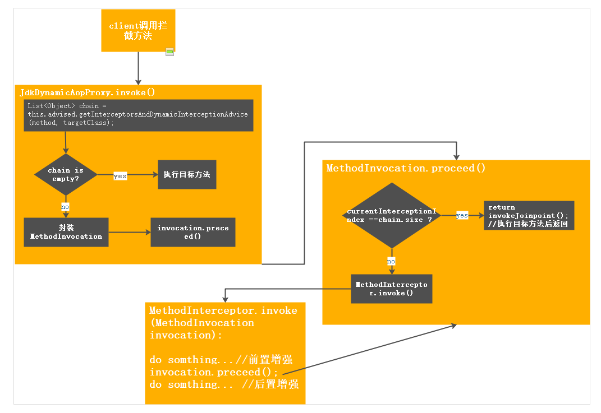

## AOP详解(三): 方法执行

方法执行时通过InvocationHandler.invoke。Spring AOP根据接口创建的代理，用的InvocationHandler是JdkDynamicAopProxy。

``` 
    MethodInvocation invocation;
    List<Object> chain = this.advised.getInterceptorsAndDynamicInterceptionAdvice(method, targetClass);
   
    ...
   if (chain.isEmpty()) {
        Object[] argsToUse = AopProxyUtils.adaptArgumentsIfNecessary(method, args);
        retVal = AopUtils.invokeJoinpointUsingReflection(target, method, argsToUse);
    }
    else {
        invocation = new ReflectiveMethodInvocation(proxy, target, method, args, targetClass, chain);
        retVal = invocation.proceed();
    }
    ...
```

在JdkDynamicAopProxy方法中，如果没目标方法没有拦截直接调用目标方法 <br>
有连接器则会将所有用到的调用信息包装成MethodInvocation，在invocation.proceed()中实现方法的拦截调用。在invocation.proceed()的逻辑是，循环chain表，取得对应的advice。在advice中调用invoke
```
public Object proceed() throws Throwable {
        //执行完所有的链，执行目标方法
        if (this.currentInterceptorIndex == this.interceptorsAndDynamicMethodMatchers.size() - 1) {
            return invokeJoinpoint();
        }
        Object interceptorOrInterceptionAdvice =
                this.interceptorsAndDynamicMethodMatchers.get(++this.currentInterceptorIndex);
        if (interceptorOrInterceptionAdvice instanceof InterceptorAndDynamicMethodMatcher) {
            InterceptorAndDynamicMethodMatcher dm =
                    (InterceptorAndDynamicMethodMatcher) interceptorOrInterceptionAdvice;
            if (dm.methodMatcher.matches(this.method, this.targetClass, this.arguments)) {
                return dm.interceptor.invoke(this);
            }
            else {
               
                return proceed();
            }
        }
        else {
            //执行第一个拦截器的.invoke
            return ((MethodInterceptor) interceptorOrInterceptionAdvice).invoke(this);
        }
    }
```
不同标签生成的advice:

before : AspectJMethodBeforeAdvice.class <br>
```
public Object invoke(MethodInvocation mi) throws Throwable {
        this.advice.before(mi.getMethod(), mi.getArguments(), mi.getThis() ); //先执行before增强
        return mi.proceed(); //再执行其他链或目标方法
    }
```
after: AspectJAfterAdvice.class <br>
```
public Object invoke(MethodInvocation mi) throws Throwable {
        try {
            return mi.proceed(); //先执行下一个链或目标方法
        }
        finally {
            invokeAdviceMethod(getJoinPointMatch(), null, null); //后再执行增强方法
        }
    }
```
after-returning：AspectJAfterReturningAdvice.class <br>  
```
public Object invoke(MethodInvocation mi) throws Throwable {
        Object retVal = mi.proceed();
        this.advice.afterReturning(retVal, mi.getMethod(), mi.getArguments(), mi.getThis());
        return retVal;
    }
```
after-throwing ： AspectJAfterThrowingAdvice.class  <br> 
```
public Object invoke(MethodInvocation mi) throws Throwable {
    try {
        return mi.proceed();
    }
    catch (Throwable ex) {
        if (shouldInvokeOnThrowing(ex)) {
            invokeAdviceMethod(getJoinPointMatch(), null, ex);
        }
        throw ex;
    }
}
```
around: AspectJAroundAdvice.class  
```
public Object invoke(MethodInvocation mi) throws Throwable {
        if (!(mi instanceof ProxyMethodInvocation)) {
            throw new IllegalStateException("MethodInvocation is not a Spring ProxyMethodInvocation: " + mi);
        }
        ProxyMethodInvocation pmi = (ProxyMethodInvocation) mi;
        ProceedingJoinPoint pjp = lazyGetProceedingJoinPoint(pmi);
        JoinPointMatch jpm = getJoinPointMatch(pmi);
        return invokeAdviceMethod(pjp, jpm, null, null);
    }
```

ReflectiveMethodInvocation.proceed()递归调用，执行完chain上所有的invoke方法，proceed()的返回条件是执行完所有的拦截器
```
if (this.currentInterceptorIndex == this.interceptorsAndDynamicMethodMatchers.size() - 1) {
        return invokeJoinpoint();
    }
```

方法执行调用的是JDK提供的method.invoke方法。

总结代理方法的执行示意图:
