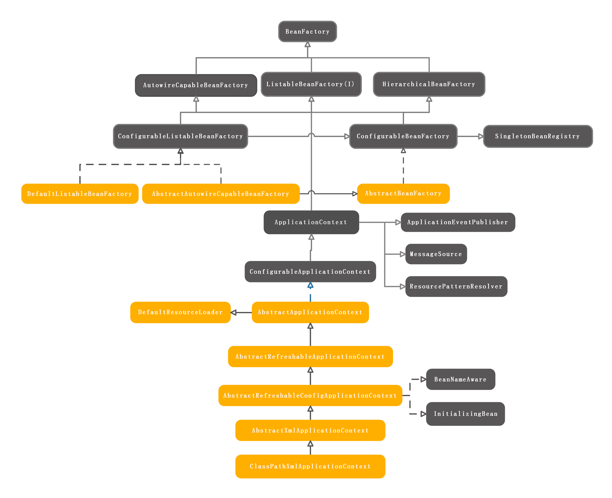

## IOC详解（一）: 概览
> Spring提供的IOC容器用于管理注册Bean的生命周期。Bean的初始化，依赖关系等都由IOC容器管理。IOC容器提供BeanFactory对外提供获取Bean的方法。

BeanFactory的庞大家族：

**BeanFactory**是最上层的接口，定义了各种获取Bean的接口以及判断Bean是否存在，是否是单例一些方法。 
**HierarchicalBeanFactory**提供获取ParentBeanFactory的方法。 
**ListableBeanFactory** 可以根据type获取bean name列表，根据type获取bean的列表。 
**AbstractBeanFacoty**BeanFactory的一些基本功能实现。
**ApplicatonBean**一个更加强大的功能的IOC接口，提供事件发布，资源访问，国际化支持功能。 

IOC容器载入Bean的配置并解析构造成BeanDefination注册。过程示意图：
  
XML配置文件经由ResourceLoader载入成为Resource，解析工作由BeanDefinationReder完成后通过BeanRegister注册到容器中。其中Bean的定义在Spring中用BeanDefination表示。

以ClassPathXmlApplicationContext为例,在获取初始化ClassPathXmlApplicationContext中obtainBeanFactory()中完成BeanFactory的创建，Bean的解析以及注册，Bean的解析注册过程示意图:

获取Bean的示意图：

