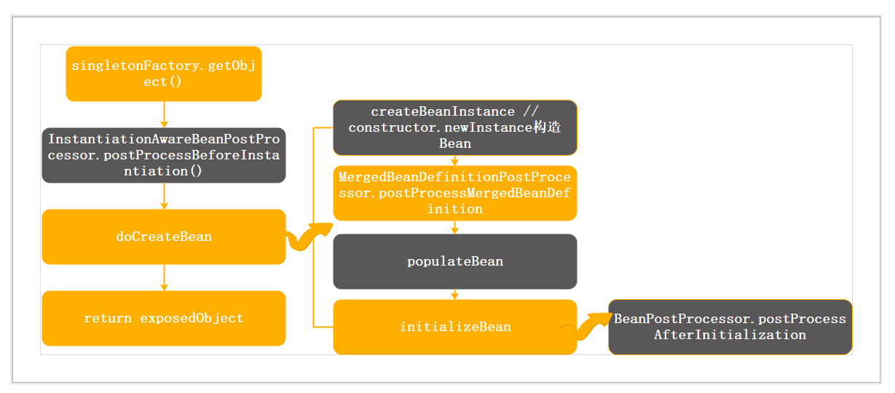
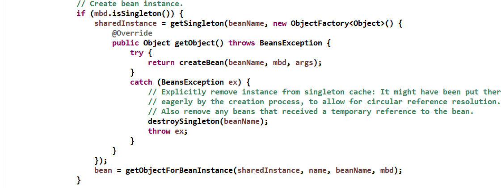

## IOC详解(三)： 初始化Bean
容器解析完bean配置后，会初始化单例Bean。初始化示意图


bean创建使用工厂模式，通过实现ObjectFacotry定义一个生产对象工厂：
```
public interface ObjectFactory<T> {
	T getObject() throws BeansException;
}

```
doCreateBean:



单例对象的创建，最终调用getObject。

在最终创建单例之前，会先处理BeanPostProcesseor.postProcessBeforeInstianiation()方法。<br>
Spring创建单例是通过构造器的newInstance的方法  <br>
populateBean 设置依赖关系 <br>
创建实例之后，BeanPostProcesseor.postProcessAfterInstantiation，初始化后处理<br>

初始化完成后，放入缓存中
```
protected void addSingleton(String beanName, Object singletonObject) {
    synchronized (this.singletonObjects) {
        //singletonObjects:用于存放完全初始化好的 bean，从该缓存中取出的 bean 可以直接使用
        this.singletonObjects.put(beanName, (singletonObject != null ? singletonObject : NULL_OBJECT));
        this.singletonFactories.存放 bean 工厂对象，用于解决循环依赖remove(beanName);
        //singletonFactories：
        //earlySingletonObjects：存放原始的 bean 对象（尚未填充属性），用于解决循环依赖
        this.earlySingletonObjects.remove(beanName);
        this.registeredSingletons.add(beanName);
    }
}
```