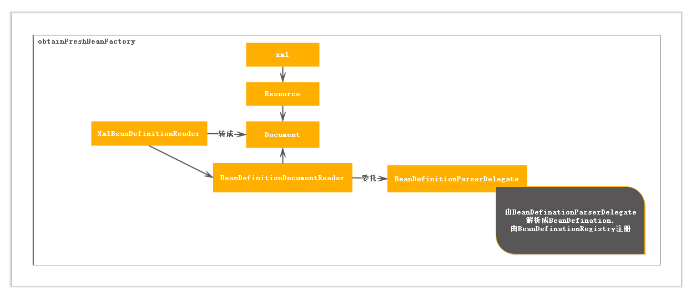

## IOC详解(二): 配置解析注册
>Spring提供注解方式以及XML配置方式配置Bean以及Bean的依赖关系。

<br>
#####XML配置方式解析(分析ClassPathXmlApplicationContext)

配置解析方式总体流程

解析先将配置文件XML转成Resource最终转成Document交由BeanDefinitionDocumentReader处理

元素的解析分为默认元素解析与定制元素解析,不同元素不同方法解析：

```
protected void parseBeanDefinitions(Element root, BeanDefinitionParserDelegate delegate) {
    if (delegate.isDefaultNamespace(root)) {
        NodeList nl = root.getChildNodes();
        for (int i = 0; i < nl.getLength(); i++) {
            Node node = nl.item(i);
            if (node instanceof Element) {
                Element ele = (Element) node;
                if (delegate.isDefaultNamespace(ele)) {
                    //默认元素解析
                    parseDefaultElement(ele, delegate);
                }
                else {
                    //自定义元素解析
                    delegate.parseCustomElement(ele);
                }
            }
        }
    }
    else {
        delegate.parseCustomElement(root);
    }
}

private void parseDefaultElement(Element ele, BeanDefinitionParserDelegate delegate) {
    //import
    if (delegate.nodeNameEquals(ele, IMPORT_ELEMENT)) {
        importBeanDefinitionResource(ele);
    }
    //alias
    else if (delegate.nodeNameEquals(ele, ALIAS_ELEMENT)) {
        processAliasRegistration(ele);
    }
    //bean
    else if (delegate.nodeNameEquals(ele, BEAN_ELEMENT)) {
        processBeanDefinition(ele, delegate);
    }
    bean
    else if (delegate.nodeNameEquals(ele, NESTED_BEANS_ELEMENT)) {
        // recurse
        doRegisterBeanDefinitions(ele);
    }
}
```

详细解析<bean\>元素解析过程：
```
protected void processBeanDefinition(Element ele, BeanDefinitionParserDelegate delegate) {
    //（一）bean解析成BeanDefination后包装成BeanDefinitionHolder
    BeanDefinitionHolder bdHolder = delegate.parseBeanDefinitionElement(ele);
    if (bdHolder != null) {
        //额外的配置
        bdHolder = delegate.decorateBeanDefinitionIfRequired(ele, bdHolder);
        try {
            //注册
            BeanDefinitionReaderUtils.registerBeanDefinition(bdHolder, getReaderContext().getRegistry());
        }
        catch (BeanDefinitionStoreException ex) {
            getReaderContext().error("Failed to register bean definition with name '" +
                    bdHolder.getBeanName() + "'", ele, ex);
        }
        getReaderContext().fireComponentRegistered(new BeanComponentDefinition(bdHolder));
    }
}
```

（一）bean解析成BeanDefination后包装成BeanDefinitionHolder:

元素的解析：
```
public AbstractBeanDefinition parseBeanDefinitionElement(
            Element ele, String beanName, BeanDefinition containingBean) {
    String className = null;
    if (ele.hasAttribute(CLASS_ATTRIBUTE)) {
        className = ele.getAttribute(CLASS_ATTRIBUTE).trim();
    }

    try {
            String parent = null;
            if (ele.hasAttribute(PARENT_ATTRIBUTE)) {
                parent = ele.getAttribute(PARENT_ATTRIBUTE);
            }
            //生成一个GenericBeanDefinition
            AbstractBeanDefinition bd = createBeanDefinition(className, parent);
            //解析scope,abstract,lazy-init,autowire,dependency-check,primary,init-method...属性
            parseBeanDefinitionAttributes(ele, beanName, containingBean, bd);
            bd.setDescription(DomUtils.getChildElementValueByTagName(ele, DESCRIPTION_ELEMENT));

            parseMetaElements(ele, bd);
            parseLookupOverrideSubElements(ele, bd.getMethodOverrides());
            parseReplacedMethodSubElements(ele, bd.getMethodOverrides());
            //解析constructor-arg属性,放在ConstructorArgumentValues中
            parseConstructorArgElements(ele, bd);
            //解析property属性，放在MutablePropertyValues中
            parsePropertyElements(ele, bd);
            //解析qualifier
            parseQualifierElements(ele, bd);

            bd.setResource(this.readerContext.getResource());
            bd.setSource(extractSource(ele));

            return bd;
    }
        ...
}
```

所有Bean的定义解析成BeanDefiantion注册到Spring中。这里实例化的BeanDefination是GenericBeanDefinition类型。GenericBeanDefinition的类层次结构：
 <br>
在AbstractBeanDefination中定义bean所需要的各种属性:
```
public abstract class AbstractBeanDefinition extends BeanMetadataAttributeAccessor
        implements BeanDefinition, Cloneable {

    ...
    private volatile Object beanClass;
    private String scope = SCOPE_DEFAULT;
    private boolean abstractFlag = false;
    private boolean lazyInit = false;
    private int autowireMode = AUTOWIRE_NO;
    private int dependencyCheck = DEPENDENCY_CHECK_NONE;
    private String[] dependsOn;
    private boolean autowireCandidate = true;
    private boolean primary = false;
    private final Map<String, AutowireCandidateQualifier> qualifiers =
            new LinkedHashMap<String, AutowireCandidateQualifier>(0);
    private boolean nonPublicAccessAllowed = true;
    private boolean lenientConstructorResolution = true;
    private ConstructorArgumentValues constructorArgumentValues;
    private MutablePropertyValues propertyValues;
    private MethodOverrides methodOverrides = new MethodOverrides();
    private String factoryBeanName;
    private String factoryMethodName;
    private String initMethodName;
    private String destroyMethodName;
    private boolean enforceInitMethod = true;
    private boolean enforceDestroyMethod = true;
    private boolean synthetic = false;
    private int role = BeanDefinition.ROLE_APPLICATION;
    private String description;
    private Resource resource;
    ...
}
```
解析完bean配置，实现注册的方法 BeanDefinitionReaderUtils.registerBeanDefinition(bdHolder, getReaderContext().getRegistry())。
```
    ...
    this.beanDefinitionMap.put(beanName, beanDefinition);
    this.beanDefinitionNames.add(beanName);
    this.manualSingletonNames.remove(beanName);
    ...
```

#### 注解方式解析
注解配置方式需要指定基础扫描包：
```
<context:component-scan
        base-package="pro.jing.bean.di.annotation"></context:component-scan>
```
Spring通过对context:component-scan元素,读取classPath下基础包中的注解实现解析生成BeanDefination。context:component-scan不是默认元素，所以这里用到自定义解析方法
```
protected void parseBeanDefinitions(Element root, BeanDefinitionParserDelegate delegate) {
    ...
    delegate.parseCustomElement(ele);
    ...     
}

public BeanDefinition parseCustomElement(Element ele, BeanDefinition containingBd) {
    String namespaceUri = getNamespaceURI(ele);
    NamespaceHandler handler = this.readerContext.getNamespaceHandlerResolver().resolve(namespaceUri);
    if (handler == null) {
        error("Unable to locate Spring NamespaceHandler for XML schema namespace [" + namespaceUri + "]", ele);
        return null;
    }
    return handler.parse(ele, new ParserContext(this.readerContext, this, containingBd));
}
```

自定义元素配置根据配置的namespace:handler关系取得解析器。该配置在jar包的META-INF的spring.handler下。
context前缀解析器在ContextNamespaceHandler中初始化。
```
public void init() {
        registerBeanDefinitionParser("property-placeholder", new PropertyPlaceholderBeanDefinitionParser());
        registerBeanDefinitionParser("property-override", new PropertyOverrideBeanDefinitionParser());
        registerBeanDefinitionParser("annotation-config", new AnnotationConfigBeanDefinitionParser());
        registerBeanDefinitionParser("component-scan", new ComponentScanBeanDefinitionParser());
        registerBeanDefinitionParser("load-time-weaver", new LoadTimeWeaverBeanDefinitionParser());
        registerBeanDefinitionParser("spring-configured", new SpringConfiguredBeanDefinitionParser());
        registerBeanDefinitionParser("mbean-export", new MBeanExportBeanDefinitionParser());
        registerBeanDefinitionParser("mbean-server", new MBeanServerBeanDefinitionParser());
    }
```

component-scan用ComponentScanBeanDefinitionParser解析。解析方法：
```
public BeanDefinition parse(Element element, ParserContext parserContext) {

    String basePackage = element.getAttribute(BASE_PACKAGE_ATTRIBUTE);
    basePackage = parserContext.getReaderContext().getEnvironment().resolvePlaceholders(basePackage);
    // 分割多个basePackages， 用逗号分隔
    String[] basePackages = StringUtils.tokenizeToStringArray(basePackage,
            ConfigurableApplicationContext.CONFIG_LOCATION_DELIMITERS);

    //扫描Bean的方法
    ClassPathBeanDefinitionScanner scanner = configureScanner(parserContext, element);
    Set<BeanDefinitionHolder> beanDefinitions = scanner.doScan(basePackages);
    registerComponents(parserContext.getReaderContext(), beanDefinitions, element);

    return null;
}

protected Set<BeanDefinitionHolder> doScan(String... basePackages) {
    
    Set<BeanDefinitionHolder> beanDefinitions = new LinkedHashSet<BeanDefinitionHolder>();
    //依次扫描配置
    for (String basePackage : basePackages) {
        //找到有注解的类
        Set<BeanDefinition> candidates = findCandidateComponents(basePackage);
        //
        for (BeanDefinition candidate : candidates) {
            ScopeMetadata scopeMetadata = this.scopeMetadataResolver.resolveScopeMetadata(candidate);
            candidate.setScope(scopeMetadata.getScopeName());
            String beanName = this.beanNameGenerator.generateBeanName(candidate, this.registry);
            if (candidate instanceof AbstractBeanDefinition) {
                postProcessBeanDefinition((AbstractBeanDefinition) candidate, beanName);
            }
            if (candidate instanceof AnnotatedBeanDefinition) {
                //解析在Bean上的注解，设置对应的属性
                AnnotationConfigUtils.processCommonDefinitionAnnotations((AnnotatedBeanDefinition) candidate);
            }
            if (checkCandidate(beanName, candidate)) {
                BeanDefinitionHolder definitionHolder = new BeanDefinitionHolder(candidate, beanName);
                definitionHolder = AnnotationConfigUtils.applyScopedProxyMode(scopeMetadata, definitionHolder, this.registry);
                beanDefinitions.add(definitionHolder);
                注册Bean
                registerBeanDefinition(definitionHolder, this.registry);
            }
        }
    }
    return beanDefinitions;
}
```

1. 配置context:component-scan,由ComponentScanBeanDefinitionParser解析。在解析过程中定义扫描器ClassPathBeanDefinitionScanner扫描配置的base-package属性，多个包用","隔离，分别扫描各个包。
2. 扫描各个包会将base-package加上chasspath*:base-package/**/*.class
3. 用ResourcePatternResoulver加载resource，用各种MedataReader解析加载的resource的配置并查看是否是需要注册的Bean。添加到Set<BeanDefinition> candidates中。(ScannedGenericBeanDefinition 类型)
4. 最后设置candidates中的各种属性(scope,primary,depeandsOn等),注册到BeanFactory中
