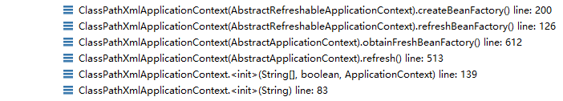
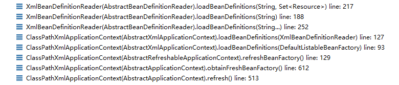

## IOC详解(四): 容器初始化总体过程
容器初始化除了Bean的解析注册以及初始化之后，还包括一些其他处理。包括注册事件处理等...

容器创建过程在refresh()完成：
```
public void refresh() throws BeansException, IllegalStateException {
        synchronized (this.startupShutdownMonitor) {
            // 准备刷新
            prepareRefresh();
            // 获取BeanFactory，解析注册Bean
            ConfigurableListableBeanFactory beanFactory = obtainFreshBeanFactory();
            prepareBeanFactory(beanFactory);
            try {
                postProcessBeanFactory(beanFactory);
                // BeanFactoryPostProcessor.postProcessBeanFactory
                invokeBeanFactoryPostProcessors(beanFactory);
                registerBeanPostProcessors(beanFactory);
                initMessageSource();
                //事件处理器
                initApplicationEventMulticaster();
                onRefresh();
                //监听器
                registerListeners();
                //初始化单例Bean
                finishBeanFactoryInitialization(beanFactory);
                finishRefresh();
            }
            ...
    }
```

容器创建过程：</br>
 </br>

ClassPathXmlApplicationContext构造函数，调用refresh()刷新BeanFactory。最终调用createBeanFactory()创建ApplicationContext。最终返回的是DefaultListableBeanFactory。
```
    protected DefaultListableBeanFactory createBeanFactory() {
        return new DefaultListableBeanFactory(getInternalParentBeanFactory());
    }
```

有了BeanFactory后，对配置解析：
解析之前将xml配置转成Resource
调用过程:</br>
</br>
Xml配置文件通过ResourceLoader转成Resource。
```
public abstract class AbstractBeanDefinitionReader implements EnvironmentCapable, BeanDefinitionReader {
    ...

    public int loadBeanDefinitions(String location, Set<Resource> actualResources) throws BeanDefinitionStoreException {
        ResourceLoader resourceLoader = getResourceLoader();

        ...

        else {
            
            Resource resource = resourceLoader.getResource(location);
            int loadCount = loadBeanDefinitions(resource);
    
            return loadCount;
        }
        ...
    }

    ...
}
```
转成Resource，解析配置信息。 
[IOC容器Bean解析详解](IOC详解(二)解析.md)
