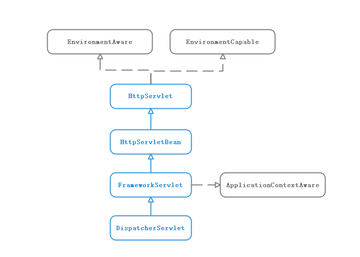

## Spring MVC启动过程

使用Spring MVC作为MVC的框架，需要在web.xml中配置DispatcherServlet。
```
	<servlet>
		<servlet-name>springmvc</servlet-name>
		<servlet-class>org.springframework.web.servlet.DispatcherServlet</servlet-class>

		<load-on-startup>1</load-on-startup>
	</servlet>
```
DispatcherServlet类图结构：

DispatcherServlet作为Spring MVC处理的最外层，由Servlet容器调用init()初始化(Servlet的初始化过程)。init()由DispatcherServlet类图层次中的HttpServletBean.init()实现
```
public final void init() throws ServletException {

		try {
			PropertyValues pvs = new ServletConfigPropertyValues(getServletConfig(), this.requiredProperties); //（1）
			BeanWrapper bw = PropertyAccessorFactory.forBeanPropertyAccess(this); //(2)
			ResourceLoader resourceLoader = new ServletContextResourceLoader(getServletContext()); //（3）
			bw.registerCustomEditor(Resource.class, new ResourceEditor(resourceLoader, getEnvironment())); //（4）
			initBeanWrapper(bw); //（5）
			bw.setPropertyValues(pvs, true); //（6）
		}
		catch (BeansException ex) {
			logger.error("Failed to set bean properties on servlet '" + getServletName() + "'", ex);
			throw ex;
		}

		initServletBean(); (7)
	}
```
(1) 读取initParam设置 </br>
(2) 将当前对象包装成一个BeanWapper </br>
(3) 构造ResourceLoader </br>
(4) 注册CustomEditor </br>
(5) 空 </br>
(6) 将initParam设置成bw的Property </br>
(7) 初始化Servlet </br>

initServletBean()中完成ApplicationContext初始化。
```
protected final void initServletBean() throws ServletException {
		
		long startTime = System.currentTimeMillis();

		try {
			this.webApplicationContext = initWebApplicationContext(); //（1）
			initFrameworkServlet(); //（2）
		}
		catch (ServletException ex) {
			this.logger.error("Context initialization failed", ex);
			throw ex;
		}
		catch (RuntimeException ex) {
			this.logger.error("Context initialization failed", ex);
			throw ex;
		}
	}
```
（1）初始化webApplicationContext  </br>
（2）空 </br>

```
protected WebApplicationContext initWebApplicationContext() {
		WebApplicationContext rootContext =
				WebApplicationContextUtils.getWebApplicationContext(getServletContext());
		WebApplicationContext wac = null;

		if (this.webApplicationContext != null) { （1）
			wac = this.webApplicationContext;
			if (wac instanceof ConfigurableWebApplicationContext) {
				ConfigurableWebApplicationContext cwac = (ConfigurableWebApplicationContext) wac;
				if (!cwac.isActive()) {
					if (cwac.getParent() == null) {
					
						cwac.setParent(rootContext);
					}
					configureAndRefreshWebApplicationContext(cwac);
				}
			}
		}
		if (wac == null) { （2）
			wac = findWebApplicationContext();
		}
		if (wac == null) { （3）
			wac = createWebApplicationContext(rootContext);
		}

		if (!this.refreshEventReceived) { （4）
			onRefresh(wac);
		}

		if (this.publishContext) { （5）
			String attrName = getServletContextAttributeName();
			getServletContext().setAttribute(attrName, wac);
		}

		return wac;
	}
```
主要解析wac的初始化。 </br>
(1) 如果wac不为空，重写刷新ApplicationContext </br>
(2) 如果wac为空，通过findWebApplicationContext()来获取 </br>
(3) 如果wac为空，通过createWebApplicationContext新建（第一次进来时）</br>
(4) 设置各种处理器(resolver)
(5) 设置wac为Web应用的属性</br>

createWebApplicationContext()
```
protected WebApplicationContext createWebApplicationContext(ApplicationContext parent) {
	Class<?> contextClass = getContextClass(); (1)
	
	if (!ConfigurableWebApplicationContext.class.isAssignableFrom(contextClass)) {
		throw new ApplicationContextException(
				"Fatal initialization error in servlet with name '" + getServletName() +
				"': custom WebApplicationContext class [" + contextClass.getName() +
				"] is not of type ConfigurableWebApplicationContext");
	}
	ConfigurableWebApplicationContext wac =  (2)
			(ConfigurableWebApplicationContext) BeanUtils.instantiateClass(contextClass);

	wac.setEnvironment(getEnvironment()); 
	wac.setParent(parent); 
	wac.setConfigLocation(getContextConfigLocation()); 

	configureAndRefreshWebApplicationContext(wac); (3)

	return wac;
}
```
(1) 得到wac的Class，默认是XmlWebApplicationContext.class </br>
(2) 通过得到的class，用反射构造一个ConfigurableWebApplicationContext </br>
(3) 刷新WebApplicationContext(IOC容器的初始化过程)，实现主要调用wac.refresh() </br>

有了WebApplicationContext之后,设置各种处理器(resolver)
```
protected void initStrategies(ApplicationContext context) {
	initMultipartResolver(context);
	initLocaleResolver(context);
	initThemeResolver(context);
	initHandlerMappings(context);
	initHandlerAdapters(context);
	initHandlerExceptionResolvers(context);
	initRequestToViewNameTranslator(context);
	initViewResolvers(context);
	initFlashMapManager(context);
}
```

String MVC自身创建的过程，Servlet共有3个层次，HttpServletBean,FrameworkServlet,DispatcherServlet。<br>
HttpServletBean将Servlet中配置的参数设置到响应的属性。 <br>
FrameworkServlet初始化WebApplicationContext <br>
DispatcherServlet初始化自身9个组件

到此Spring MVC启动就结束了。

