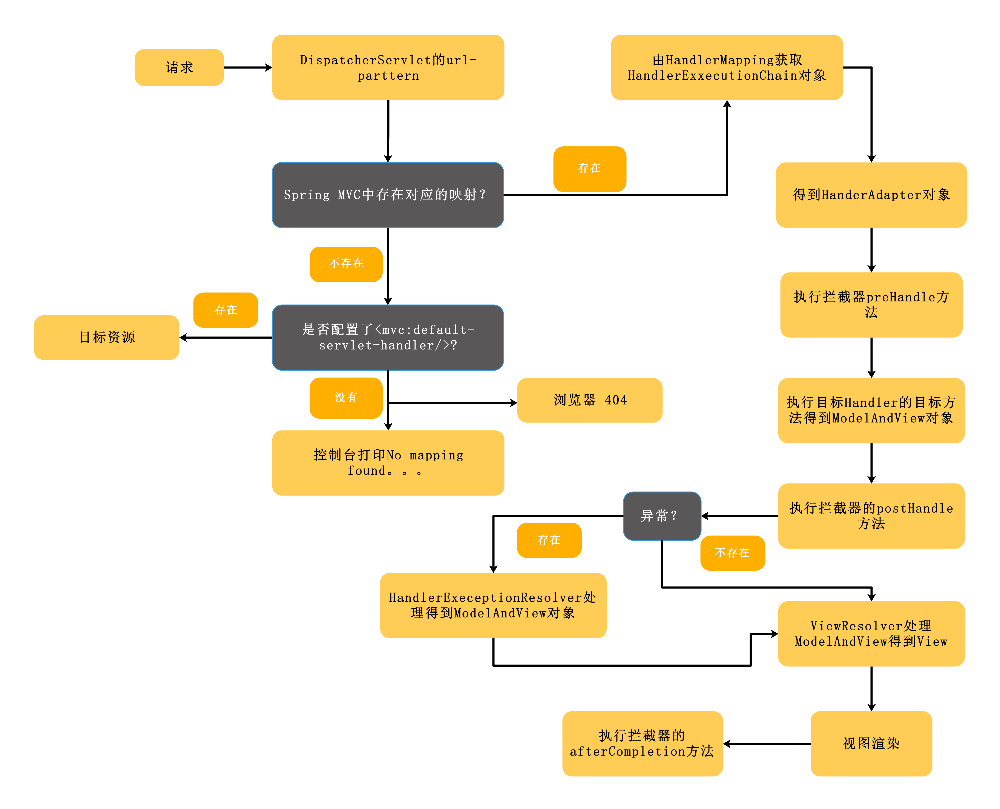

## Spring MVC执行流程.md

Spring MVC的总体执行流程:


Spring MVC的主线流程由DispatcherServlet处理，请求进入之后最终会有DispatcherServlet的doDispatch()方法处理。（代码中删除了一些非主流程代码）
```
protected void doDispatch(HttpServletRequest request, HttpServletResponse response) throws Exception {
		HttpServletRequest processedRequest = request;
		HandlerExecutionChain mappedHandler = null;
		boolean multipartRequestParsed = false;

		WebAsyncManager asyncManager = WebAsyncUtils.getAsyncManager(request);

		try {
			ModelAndView mv = null;
			Exception dispatchException = null;

			try {
				processedRequest = checkMultipart(request);
				multipartRequestParsed = (processedRequest != request);

				
				mappedHandler = getHandler(processedRequest); (1)
				if (mappedHandler == null || mappedHandler.getHandler() == null) {
					noHandlerFound(processedRequest, response);
					return;
				}

				
				HandlerAdapter ha = getHandlerAdapter(mappedHandler.getHandler()); (2)

			
				String method = request.getMethod();
				boolean isGet = "GET".equals(method);
				if (isGet || "HEAD".equals(method)) {
					long lastModified = ha.getLastModified(request, mappedHandler.getHandler());
					if (logger.isDebugEnabled()) {
						logger.debug("Last-Modified value for [" + getRequestUri(request) + "] is: " + lastModified);
					}
					if (new ServletWebRequest(request, response).checkNotModified(lastModified) && isGet) {
						return;
					}
				}

				if (!mappedHandler.applyPreHandle(processedRequest, response)) { (3)
					return;
				}

			
				mv = ha.handle(processedRequest, response, mappedHandler.getHandler()); (4)

				if (asyncManager.isConcurrentHandlingStarted()) {
					return;
				}

				applyDefaultViewName(processedRequest, mv); (5)
				mappedHandler.applyPostHandle(processedRequest, response, mv); (6)
			}
			catch (Exception ex) {
				dispatchException = ex;
			}
			catch (Throwable err) {
				// As of 4.3, we're processing Errors thrown from handler methods as well,
				// making them available for @ExceptionHandler methods and other scenarios.
				dispatchException = new NestedServletException("Handler dispatch failed", err);
			}
			processDispatchResult(processedRequest, response, mappedHandler, mv, dispatchException); (7)
		}
		...
	}
```
(1)根据request获取执行链HandlerExecutionChain <br>
(2)根据执行链获取要给处理适配器	<br>
(3)执行拦截器的preHandler方法	<br>
(4)执行真正的业务逻辑代码，得到要给ModelAndView	<br>
(5)由ModelAndView得到View		<br>
(6)执行拦截器的postHandler方法	<br>
(7)处理view,渲染试图，调用拦截器的afterCompletion方法		<br>

####(1）根据request获取执行链HandlerExecutionChain
HandlerExecutionChain中包含目标执行方法以及拦截器链。执行链的获取是根据HandlerMapping来获取的。
```
	protected HandlerExecutionChain getHandler(HttpServletRequest request) throws Exception {
		for (HandlerMapping hm : this.handlerMappings) {
			//根据HandlerMapping
			HandlerExecutionChain handler = hm.getHandler(request);
			if (handler != null) {
				return handler;
			}
		}
		return null;
	}

```

```
	public final HandlerExecutionChain getHandler(HttpServletRequest request) throws Exception {
		Object handler = getHandlerInternal(request); (1)
		if (handler == null) {
			handler = getDefaultHandler();
		}
		if (handler == null) {
			return null;
		}
		if (handler instanceof String) {
			String handlerName = (String) handler;
			handler = getApplicationContext().getBean(handlerName);
		}

		HandlerExecutionChain executionChain = getHandlerExecutionChain(handler, request); (2)
		if (CorsUtils.isCorsRequest(request)) {
			CorsConfiguration globalConfig = this.corsConfigSource.getCorsConfiguration(request);
			CorsConfiguration handlerConfig = getCorsConfiguration(handler, request);
			CorsConfiguration config = (globalConfig != null ? globalConfig.combine(handlerConfig) : handlerConfig);
			executionChain = getCorsHandlerExecutionChain(request, executionChain, config);
		}
		return executionChain;
	}
```

(1)获取处理器 <br>
(2)得到执行链 <br>

HandlerMapping是请求与处理的映射器。HandlerExecutionChain根据DispatcherServlet中已经配置的handlerMappings依次匹配。在Spring MVC启动过程中，解析存在的映射器(没有配置默认的映射器的情况下)：

请求与处理器匹配,获取处理器：
```
protected Object lookupHandler(String urlPath, HttpServletRequest request) throws Exception {
		
		Object handler = this.handlerMap.get(urlPath); (1)
		if (handler != null) {
			if (handler instanceof String) {
				String handlerName = (String) handler;
				handler = getApplicationContext().getBean(handlerName);
			}
			validateHandler(handler, request);
			return buildPathExposingHandler(handler, urlPath, urlPath, null);
		}
		List<String> matchingPatterns = new ArrayList<String>();
		for (String registeredPattern : this.handlerMap.keySet()) { (2)
			if (getPathMatcher().match(registeredPattern, urlPath)) {
				matchingPatterns.add(registeredPattern);
			}
			else if (useTrailingSlashMatch()) {
				if (!registeredPattern.endsWith("/") && getPathMatcher().match(registeredPattern + "/", urlPath)) {
					matchingPatterns.add(registeredPattern +"/");
				}
			}
		}
		String bestPatternMatch = null;
		Comparator<String> patternComparator = getPathMatcher().getPatternComparator(urlPath);
		if (!matchingPatterns.isEmpty()) {
			Collections.sort(matchingPatterns, patternComparator);
			if (logger.isDebugEnabled()) {
				logger.debug("Matching patterns for request [" + urlPath + "] are " + matchingPatterns);
			}
			bestPatternMatch = matchingPatterns.get(0);
		}
		if (bestPatternMatch != null) {
			handler = this.handlerMap.get(bestPatternMatch);
			if (handler == null) {
				Assert.isTrue(bestPatternMatch.endsWith("/"));
				handler = this.handlerMap.get(bestPatternMatch.substring(0, bestPatternMatch.length() - 1));
			}
			
			if (handler instanceof String) {
				String handlerName = (String) handler;
				handler = getApplicationContext().getBean(handlerName);
			}
			validateHandler(handler, request);
			String pathWithinMapping = getPathMatcher().extractPathWithinPattern(bestPatternMatch, urlPath);

			Map<String, String> uriTemplateVariables = new LinkedHashMap<String, String>();
			for (String matchingPattern : matchingPatterns) {
				if (patternComparator.compare(bestPatternMatch, matchingPattern) == 0) {
					Map<String, String> vars = getPathMatcher().extractUriTemplateVariables(matchingPattern, urlPath);
					Map<String, String> decodedVars = getUrlPathHelper().decodePathVariables(request, vars);
					uriTemplateVariables.putAll(decodedVars);
				}
			}
	
			return buildPathExposingHandler(handler, bestPatternMatch, pathWithinMapping, uriTemplateVariables);
		}
		return null;
	}
```
匹配过程分为直接匹配和模式匹配。直接匹配从handlerMap中通过urlPath找到对应的handler。模式匹配通过Match找到对应的handler。如果有多个取第一个作为handler返回。

获取到处理器之后，取得执行链
```
	protected HandlerExecutionChain getHandlerExecutionChain(Object handler, HttpServletRequest request) {
		HandlerExecutionChain chain = (handler instanceof HandlerExecutionChain ?
				(HandlerExecutionChain) handler : new HandlerExecutionChain(handler));

		String lookupPath = this.urlPathHelper.getLookupPathForRequest(request);
		for (HandlerInterceptor interceptor : this.adaptedInterceptors) {
			if (interceptor instanceof MappedInterceptor) {
				// matches方法匹配执行的拦截器
				MappedInterceptor mappedInterceptor = (MappedInterceptor) interceptor;
				if (mappedInterceptor.matches(lookupPath, this.pathMatcher)) {
					chain.addInterceptor(mappedInterceptor.getInterceptor());
				}
			}
			else {
				chain.addInterceptor(interceptor);
			}
		}
		return chain;
	}
```
构造执行链就完成了


####(4）执行真正的业务逻辑代码，得到要给ModelAndView	
1. 数据绑定校验格式化：
数据绑定工作在handlerApdapter.handler中进行。参数处理在Object[] args = resolveHandlerArguments(handlerMethodToInvoke, handler, webRequest, implicitModel);这里进行。
```
	private Object[] resolveHandlerArguments(Method handlerMethod, Object handler,
			NativeWebRequest webRequest, ExtendedModelMap implicitModel) throws Exception {
		//获取目标处理函数需要的参数类型列表
		Class<?>[] paramTypes = handlerMethod.getParameterTypes();
		Object[] args = new Object[paramTypes.length];
		//循环处理需要的参数长度
		for (int i = 0; i < args.length; i++) {
			MethodParameter methodParam = new SynthesizingMethodParameter(handlerMethod, i);
			methodParam.initParameterNameDiscovery(this.parameterNameDiscoverer);
			GenericTypeResolver.resolveParameterType(methodParam, handler.getClass());
			String paramName = null;
			String headerName = null;
			boolean requestBodyFound = false;
			String cookieName = null;
			String pathVarName = null;
			String attrName = null;
			boolean required = false;
			String defaultValue = null;
			boolean validate = false;
			Object[] validationHints = null;
			int annotationsFound = 0;
			Annotation[] paramAnns = methodParam.getParameterAnnotations();
			//带有注解的参数处理
			for (Annotation paramAnn : paramAnns) {
				if (RequestParam.class.isInstance(paramAnn)) {
					RequestParam requestParam = (RequestParam) paramAnn;
					paramName = requestParam.name();
					required = requestParam.required();
					defaultValue = parseDefaultValueAttribute(requestParam.defaultValue());
					annotationsFound++;
				}
				else if (RequestHeader.class.isInstance(paramAnn)) {
					RequestHeader requestHeader = (RequestHeader) paramAnn;
					headerName = requestHeader.name();
					required = requestHeader.required();
					defaultValue = parseDefaultValueAttribute(requestHeader.defaultValue());
					annotationsFound++;
				}
				else if (RequestBody.class.isInstance(paramAnn)) {
					requestBodyFound = true;
					annotationsFound++;
				}
				else if (CookieValue.class.isInstance(paramAnn)) {
					CookieValue cookieValue = (CookieValue) paramAnn;
					cookieName = cookieValue.name();
					required = cookieValue.required();
					defaultValue = parseDefaultValueAttribute(cookieValue.defaultValue());
					annotationsFound++;
				}
				else if (PathVariable.class.isInstance(paramAnn)) {
					PathVariable pathVar = (PathVariable) paramAnn;
					pathVarName = pathVar.value();
					annotationsFound++;
				}
				else if (ModelAttribute.class.isInstance(paramAnn)) {
					ModelAttribute attr = (ModelAttribute) paramAnn;
					attrName = attr.value();
					annotationsFound++;
				}
				else if (Value.class.isInstance(paramAnn)) {
					defaultValue = ((Value) paramAnn).value();
				}
				else {
					Validated validatedAnn = AnnotationUtils.getAnnotation(paramAnn, Validated.class);
					if (validatedAnn != null || paramAnn.annotationType().getSimpleName().startsWith("Valid")) {
						validate = true;
						Object hints = (validatedAnn != null ? validatedAnn.value() : AnnotationUtils.getValue(paramAnn));
						validationHints = (hints instanceof Object[] ? (Object[]) hints : new Object[]{hints});
					}
				}
			}
			//注解不可超过1
			if (annotationsFound > 1) {
				throw new IllegalStateException("Handler parameter annotations are exclusive choices - " +
						"do not specify more than one such annotation on the same parameter: " + handlerMethod);
			}
			//普通参数处理
			if (annotationsFound == 0) {
				Object argValue = resolveCommonArgument(methodParam, webRequest);
				if (argValue != WebArgumentResolver.UNRESOLVED) {
					args[i] = argValue;
				}
				else if (defaultValue != null) {
					args[i] = resolveDefaultValue(defaultValue);
				}
				else {
					Class<?> paramType = methodParam.getParameterType();
					if (Model.class.isAssignableFrom(paramType) || Map.class.isAssignableFrom(paramType)) {
						if (!paramType.isAssignableFrom(implicitModel.getClass())) {
							throw new IllegalStateException("Argument [" + paramType.getSimpleName() + "] is of type " +
									"Model or Map but is not assignable from the actual model. You may need to switch " +
									"newer MVC infrastructure classes to use this argument.");
						}
						args[i] = implicitModel;
					}
					else if (SessionStatus.class.isAssignableFrom(paramType)) {
						args[i] = this.sessionStatus;
					}
					else if (HttpEntity.class.isAssignableFrom(paramType)) {
						args[i] = resolveHttpEntityRequest(methodParam, webRequest);
					}
					else if (Errors.class.isAssignableFrom(paramType)) {
						throw new IllegalStateException("Errors/BindingResult argument declared " +
								"without preceding model attribute. Check your handler method signature!");
					}
					//处理一般参数
					else if (BeanUtils.isSimpleProperty(paramType)) {
						paramName = "";
					}
					//处理POJO参数
					else {
						attrName = "";
					}
				}
			}
			//不同的参数使用不同的处理方法
			if (paramName != null) {
				args[i] = resolveRequestParam(paramName, required, defaultValue, methodParam, webRequest, handler);
			}
			else if (headerName != null) {
				args[i] = resolveRequestHeader(headerName, required, defaultValue, methodParam, webRequest, handler);
			}
			else if (requestBodyFound) {
				args[i] = resolveRequestBody(methodParam, webRequest, handler);
			}
			else if (cookieName != null) {
				args[i] = resolveCookieValue(cookieName, required, defaultValue, methodParam, webRequest, handler);
			}
			else if (pathVarName != null) {
				args[i] = resolvePathVariable(pathVarName, methodParam, webRequest, handler);
			}
			else if (attrName != null) {
				WebDataBinder binder =
						resolveModelAttribute(attrName, methodParam, implicitModel, webRequest, handler);
				boolean assignBindingResult = (args.length > i + 1 && Errors.class.isAssignableFrom(paramTypes[i + 1]));
				if (binder.getTarget() != null) {
					doBind(binder, webRequest, validate, validationHints, !assignBindingResult);
				}
				args[i] = binder.getTarget();
				if (assignBindingResult) {
					args[i + 1] = binder.getBindingResult();
					i++;
				}
				implicitModel.putAll(binder.getBindingResult().getModel());
			}
		}

		return args;
	}
```
不同参数的不同处理方法详解 TODO 

####(7)处理view,渲染视图，调用拦截器的afterCompletion方法	
最后，渲染视图在processDispatchResult(processedRequest, response, mappedHandler, mv, dispatchException);
中。
```
	private void processDispatchResult(HttpServletRequest request, HttpServletResponse response,
			HandlerExecutionChain mappedHandler, ModelAndView mv, Exception exception) throws Exception {

		boolean errorView = false;

		if (exception != null) {
			if (exception instanceof ModelAndViewDefiningException) {
				logger.debug("ModelAndViewDefiningException encountered", exception);
				mv = ((ModelAndViewDefiningException) exception).getModelAndView();
			}
			else {
				Object handler = (mappedHandler != null ? mappedHandler.getHandler() : null);
				mv = processHandlerException(request, response, handler, exception);
				errorView = (mv != null);
			}
		}

		if (mv != null && !mv.wasCleared()) {
			//这里渲染试图
			render(mv, request, response);
			if (errorView) {
				WebUtils.clearErrorRequestAttributes(request);
			}
		}
		else {
			...
		}

		if (WebAsyncUtils.getAsyncManager(request).isConcurrentHandlingStarted()) {
			// Concurrent handling started during a forward
			return;
		}

		if (mappedHandler != null) {
			//拦截器的AfterCompletion方法
			mappedHandler.triggerAfterCompletion(request, response, null);
		}
	}
```
render方法渲染视图，最终的结果是将mv里的输出参数放在request里，得到视图的path用ApplcationDispatcher转发。