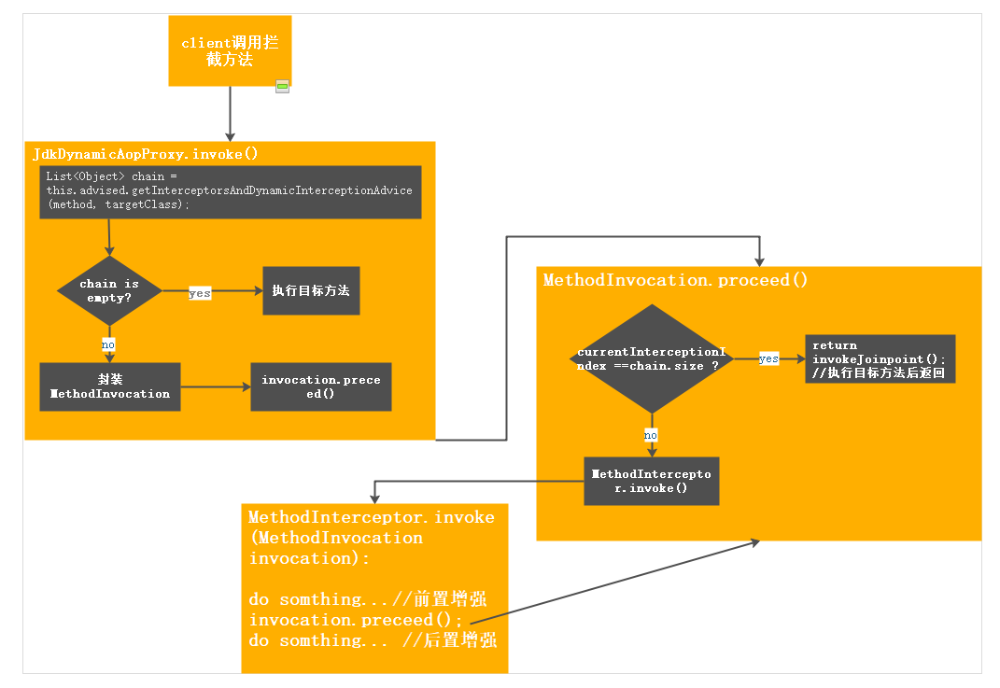
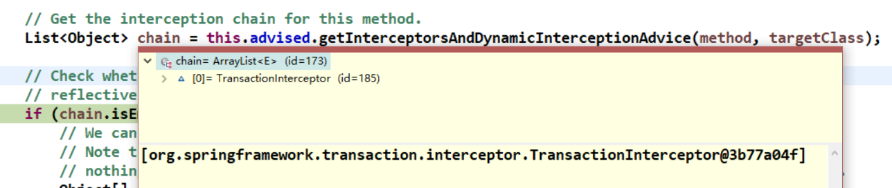

## Spring 事物管理详解(三): 方法执行

Spring事物是基于AOP实现，AOP方法执行示意图:



其中得到的增强其Advisor是BeanFactoryTransactionAttributeSourceAdvisor。应用的拦截链：


由此可知用的拦截器是TransactionInterceptor，invoke方法：
```
public Object invoke(final MethodInvocation invocation) throws Throwable {
  
    Class<?> targetClass = (invocation.getThis() != null ? AopUtils.getTargetClass(invocation.getThis()) : null);

    return invokeWithinTransaction(invocation.getMethod(), targetClass, new InvocationCallback() {
        @Override
        public Object proceedWithInvocation() throws Throwable {
            return invocation.proceed();
        }
    });
}

protected Object invokeWithinTransaction(Method method, Class<?> targetClass, final InvocationCallback invocation)
            throws Throwable {
    // 获取TransactionAttribute
    final TransactionAttribute txAttr = getTransactionAttributeSource().getTransactionAttribute(method, targetClass);
    // 事务管理器
    final PlatformTransactionManager tm = determineTransactionManager(txAttr);
    final String joinpointIdentification = methodIdentification(method, targetClass);

    if (txAttr == null || !(tm instanceof CallbackPreferringPlatformTransactionManager)) {
        //根据需要创建事物
        TransactionInfo txInfo = createTransactionIfNecessary(tm, txAttr, joinpointIdentification);
        Object retVal = null;
        try 
            retVal = invocation.proceedWithInvocation();
        }
        catch (Throwable ex) {
            //抛出异常后事物处理
            completeTransactionAfterThrowing(txInfo, ex);
            throw ex;
        }
        finally {
            //完成业务处理清理事物
            cleanupTransactionInfo(txInfo);
        }
        commitTransactionAfterReturning(txInfo);
        return retVal;
    }
    else {
     ...
    }
}

protected TransactionInfo createTransactionIfNecessary(
            PlatformTransactionManager tm, TransactionAttribute txAttr, final String joinpointIdentification) {

        if (txAttr != null && txAttr.getName() == null) {
            txAttr = new DelegatingTransactionAttribute(txAttr) {
                @Override
                public String getName() {
                    return joinpointIdentification;
                }
            };
        }

        TransactionStatus status = null;
        if (txAttr != null) {
            if (tm != null) {
                //获取事物
                status = tm.getTransaction(txAttr);
            }
            else {
                if (logger.isDebugEnabled()) {
                    logger.debug("Skipping transactional joinpoint [" + joinpointIdentification +
                            "] because no transaction manager has been configured");
                }
            }
        }
        return prepareTransactionInfo(tm, txAttr, joinpointIdentification, status);
    }
```

tm.getTransaction(txAttr)获取事物方法里，处理事物各种属性逻辑(传播属性在此处理)：

PROPAGATION_REQUIRED--支持当前事务，如果当前没有事务，就新建一个事务。这是最常见的选择。
PROPAGATION_SUPPORTS--支持当前事务，如果当前没有事务，就以非事务方式执行。
PROPAGATION_MANDATORY--支持当前事务，如果当前没有事务，就抛出异常。
PROPAGATION_REQUIRES_NEW--新建事务，如果当前存在事务，把当前事务挂起，执行当前新建事务完成以后，上下文事务恢复再执行。
PROPAGATION_NOT_SUPPORTED--以非事务方式执行操作，如果当前存在事务，就把当前事务挂起，执行当前逻辑，结束后恢复上下文的事务。
PROPAGATION_NEVER--以非事务方式执行，如果当前存在事务，则抛出异常。

```
public final TransactionStatus getTransaction(TransactionDefinition definition) throws TransactionException {
        ...
        Object transaction = doGetTransaction();
        //已经有存在的事物
        if (isExistingTransaction(transaction)) {
            // Existing transaction found -> check propagation behavior to find out how to behave.
            return handleExistingTransaction(definition, transaction, debugEnabled);
        }

        if (definition.getTimeout() < TransactionDefinition.TIMEOUT_DEFAULT) {
            throw new InvalidTimeoutException("Invalid transaction timeout", definition.getTimeout());
        }
        //事物Propagation属性处理
        if (definition.getPropagationBehavior() == TransactionDefinition.PROPAGATION_MANDATORY) {
            throw new IllegalTransactionStateException(
                    "No existing transaction found for transaction marked with propagation 'mandatory'");
        }
        else if (definition.getPropagationBehavior() == TransactionDefinition.PROPAGATION_REQUIRED ||
                definition.getPropagationBehavior() == TransactionDefinition.PROPAGATION_REQUIRES_NEW ||
                definition.getPropagationBehavior() == TransactionDefinition.PROPAGATION_NESTED) {
            SuspendedResourcesHolder suspendedResources = suspend(null);
        
            try {
                boolean newSynchronization = (getTransactionSynchronization() != SYNCHRONIZATION_NEVER);
                DefaultTransactionStatus status = newTransactionStatus(
                        definition, transaction, true, newSynchronization, debugEnabled, suspendedResources);
                doBegin(transaction, definition);
                prepareSynchronization(status, definition);
                return status;
            }
            ...
  
        }
        else {
            ...
            boolean newSynchronization = (getTransactionSynchronization() == SYNCHRONIZATION_ALWAYS);
            return prepareTransactionStatus(definition, null, true, newSynchronization, debugEnabled, null);
        }
    }
```

在已经存在的事物中，可能需要挂起已经存在的事物，用supend实现。