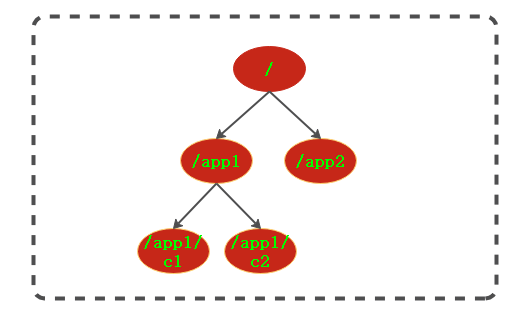
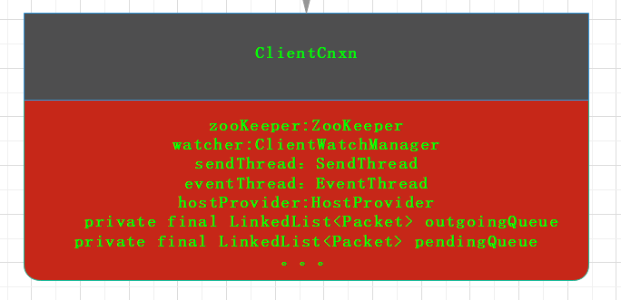
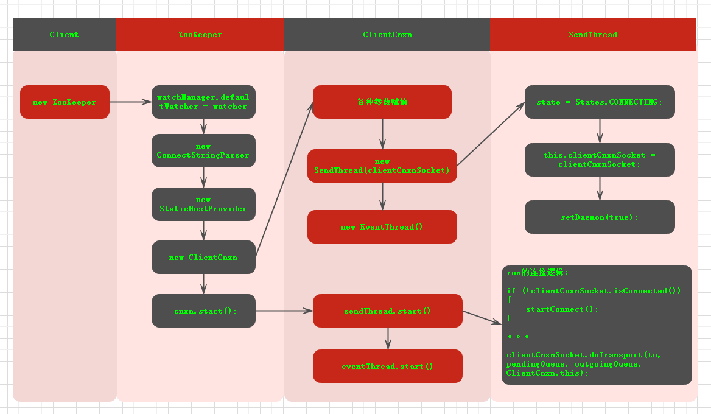

## zookeeper技术内幕

#### 系统模型

###### znode 
zk中使用叫做ZNode的数据节点保存数据或者保存子节点。访问方式通过类似路径的方法，以/开头 </br>

数据模型示意图: </br>


* znode类型：
    - 持久节点(PERSISTENT)：从节点被创建后一直存在，除非用delete删除
    - 临时节点(EPHEMERAL)：节点的生命周期依赖于客户端会话，会话结束，节点自动删除
    - 持久顺序节点(PERSISTEND_SEQUENTIAL)：有持久和顺序的特性。顺序是在Zookeeper中，每个节点都为它的第一级子节点维护一份顺序，用于记录每个字节点创建的先后顺序。
    - 临时顺序节点(EPHEMERAL_SEQUENTIAL)：有临时和顺序的特性
* znode状态：
    - 事务ID： czxid , mzxid
    - 操作时间：ctime, mtime
    - 版本信息: version, cversion, aversion(对节点的变更次数，即使值没有修改，这个值也会改动)
        +  version:当前znode数据内容的版本号。对数据内容的变更次数
        +  cversion:当前节点的子节点版本号
        +  aversion：当前ACL变更版本号
    - ephemeralOwner
    - dataLeagth
    - numChildre
    - pzxid


###### Watcher : 数据变更通知 源码TODO

ZK的watcher特性：

    1. 一次性
    2. 客户端串行执行
    3.轻量

* 客户端注册Watcher

<font color="#c62718"> a. ZooKeeper构造函数 </font>
```
 public ZooKeeper(String connectString, int sessionTimeout, Watcher watcher,
            boolean canBeReadOnly)
        throws IOException
{
    ...
    //通过构造器注册的watcher作为watchManager的默认构造器
    watchManager.defaultWatcher = watcher;
  ...
}
```

<font color="#c62718"> b. getData/getChildren/exists</font>
```
 public byte[] getData(final String path, Watcher watcher, Stat stat)
        throws KeeperException, InterruptedException
     {

        // 先将watcher放到DataWatchRegistration中.DataWatchRegistration的功能类似注册器
        WatchRegistration wcb = null;
        if (watcher != null) {
            wcb = new DataWatchRegistration(watcher, clientPath);
        }

        //标记这个请求是否有监听器
        request.setWatch(watcher != null);

        //发送请求中同时包含wcb
        ReplyHeader r = cnxn.submitRequest(h, request, response, wcb);
        ...
    }
```

在getData注册时将Watcher放在DataWatchRegistration中，发送请求时一并发给服务端。执行完之后再一并方法，取出DataWatchRegistration中的Watcher。<br>
返回response中会将DataWatchRegistration注册到zk的watchManager的dataWatcherMap中。<br>

getChildren()/exists()逻辑都是放到一个注册器中放到请求中发送，在返回响应中注册到在ZkWatcherManager中

* 服务的处理Watcher
* 客户端回调Watcher

###### ACL：权限控制

ZK中提供的ACL基于权限模式，权限对象，权限。
权限模式：schema, degist, world, super
权限对象：分配的ID
权限：create,delete,read,write,admin

#### 通信

* 建立连接
建立连接涉及到的类 ZooKeeper(对外的API客户端), ClientCnxn(client与server的交互管理), ClientCnxnSocket(连接管理器)。
连接逻辑最外层除了ZooKeeper就是ClientCnxn.
ClientCnxn类图：


outgoingQueue:发送队列 <br>
pendinggQueue:服务器响应的等待队列<br>
sendThread:管理客户端和服务端的所有IO<br>
eventThread:事件处理线程

连接过程大概示意图：


SendThread不仅仅处理发送的逻辑，其他的Request都在这里处理。

<font color="#CD6155">a. TCP 长连接 SocketChannel</font>
```
 void connect(InetSocketAddress addr) throws IOException {
        //低沉用SocketChannel实现连接
        SocketChannel sock = createSock();
        try {
           registerAndConnect(sock, addr);
        } catch (IOException e) {
            LOG.error("Unable to open socket to " + addr);
            sock.close();
            throw e;
        }
        initialized = false;

        /*
         * Reset incomingBuffer
         */
        lenBuffer.clear();
        incomingBuffer = lenBuffer;
    }

 void registerAndConnect(SocketChannel sock, InetSocketAddress addr) 
    throws IOException {
        //注册selector
        sockKey = sock.register(selector, SelectionKey.OP_CONNECT);
        //非阻塞连接
        boolean immediateConnect = sock.connect(addr);
        if (immediateConnect) {
            sendThread.primeConnection();
        }
}

//监视逻辑
 void doTransport(int waitTimeOut, List<Packet> pendingQueue, LinkedList<Packet> outgoingQueue,
                ClientCnxn cnxn) throws IOException, InterruptedException {
    //
    selector.select(waitTimeOut);
    Set<SelectionKey> selected;
    synchronized (this) {
        selected = selector.selectedKeys();
    }
    
    updateNow();
    for (SelectionKey k : selected) {
        SocketChannel sc = ((SocketChannel) k.channel());
        //连接逻辑处理
        if ((k.readyOps() & SelectionKey.OP_CONNECT) != 0) {
            if (sc.finishConnect()) {
                updateLastSendAndHeard();
                //primeConnection()包装ConnectRequet放在outputQueue等待发送，建立会话
                sendThread.primeConnection();
            }
        } else if ((k.readyOps() & (SelectionKey.OP_READ | SelectionKey.OP_WRITE)) != 0) {
            //IO处理
            doIO(pendingQueue, outgoingQueue, cnxn);
        }
    }
    if (sendThread.getZkState().isConnected()) {
        synchronized(outgoingQueue) {
            if (findSendablePacket(outgoingQueue,
                    cnxn.sendThread.clientTunneledAuthenticationInProgress()) != null) {
                enableWrite();
            }
        }
    }
    selected.clear();
}

```

<font color="#CD6155">b. 会话连接  SendThread ConnectRquest </font><br>
sendThread.primeConnection(); 包装ConnectRequest，放在outgoingQueue等待发送。发送的单位是Packet

* 发送请求

```
  void doIO(List<Packet> pendingQueue, LinkedList<Packet> outgoingQueue, ClientCnxn cnxn)
      throws InterruptedException, IOException {
        SocketChannel sock = (SocketChannel) sockKey.channel();
        ...
        //可写
        if (sockKey.isWritable()) {
            //outgoingQueue发送请求队列
            synchronized(outgoingQueue) {

                Packet p = findSendablePacket(outgoingQueue,
                        cnxn.sendThread.clientTunneledAuthenticationInProgress());
                if (p != null) {
                    updateLastSend();
                    // If we already started writing p, p.bb will already exist
                    if (p.bb == null) {
                        if ((p.requestHeader != null) &&
                                (p.requestHeader.getType() != OpCode.ping) &&
                                (p.requestHeader.getType() != OpCode.auth)) {
                            p.requestHeader.setXid(cnxn.getXid());
                        }
                        //序列化成ByteBuffer
                        p.createBB();
                    }
                    sock.write(p.bb);
                    if (!p.bb.hasRemaining()) {
                        sentCount++;
                        outgoingQueue.removeFirstOccurrence(p);
                        if (p.requestHeader != null
                                && p.requestHeader.getType() != OpCode.ping
                                && p.requestHeader.getType() != OpCode.auth) {
                            synchronized (pendingQueue) {
                                pendingQueue.add(p);
                            }
                        }
                    }
                }
                if (outgoingQueue.isEmpty()) {
                    // No more packets to send: turn off write interest flag.
                    // Will be turned on later by a later call to enableWrite(),
                    // from within ZooKeeperSaslClient (if client is configured
                    // to attempt SASL authentication), or in either doIO() or
                    // in doTransport() if not.
                    disableWrite();
                } else if (!initialized && p != null && !p.bb.hasRemaining()) {
                    // On initial connection, write the complete connect request
                    // packet, but then disable further writes until after
                    // receiving a successful connection response.  If the
                    // session is expired, then the server sends the expiration
                    // response and immediately closes its end of the socket.  If
                    // the client is simultaneously writing on its end, then the
                    // TCP stack may choose to abort with RST, in which case the
                    // client would never receive the session expired event.  See
                    // http://docs.oracle.com/javase/6/docs/technotes/guides/net/articles/connection_release.html
                    disableWrite();
                } else {
                    // Just in case
                    enableWrite();
                }
            }
        }
    }
```

* 响应处理
SendThread readResponse TODO


