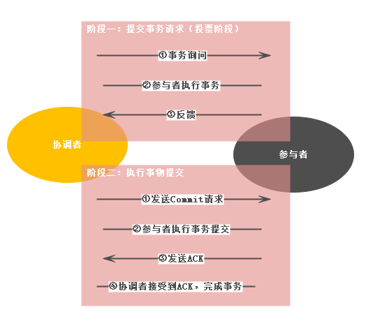
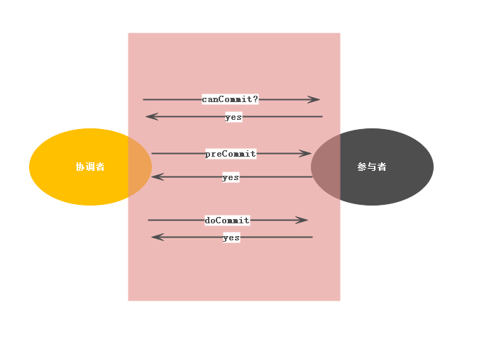

## 概论

##### 从集中式系统 -> 分布式系统

* 分布式系统可能出现的问题
     - 网络分区，形成'脑裂'。由于网络问题，一部分分布式中的节点自形成一个集群，不能与其他网络分区的节点通信。此时需要解决一致性问题
     - 通信： 通信丢失/通信延时问题
     - 三态：请求/响应可能的结果是 成功/失败/超时
     - 节点故障

* 分布式事务理论
    - CAP：分布式系统不能同时满足一致性(C:Consistency)，可用性(A:Availability)，分区容错性(P:Partition tolerance)三个需求。
    
        *概念：*

        + C(Consistency):分布式系统中一个节点对数据项的更新操作执行成功后，所有的用户都能够得到其最新的值，这时称为系统具有强一致性
        + A(Availability):对于每个用户的每一个操作总是能够在有限的时间内返回结果。这个结果是成功/失败，而不是一个困惑的结果。
        + P(Partition tolerance)：分布式系统遇到任何网络分区故障的时候，仍然需要能够保证对外提供满足一致性和可用性的服务。除非是整个网络出现故障。
        
        *应用：在实际的应用中P是需要保证的，A与C根据业务平衡*

        + 放弃P:放弃分区容错，那就需要避免形成分区。一种做法是将所有的数据都放在1个节点，这样会失了扩展性
        + 放弃A:放弃可用性在网络故障或者服务器故障，系统不可用
        + 放弃C:放弃数据强一致性，保留数据的最终一致性。
        

    - BASE：Basically Available(基本可用)，Soft State(软状态)，Eventually Consistent(最终一致性)

        *概念：*

        + Basically Available:指在系统发生故障时，在响应的时间或者返回的结果上稍微的妥协。
            * 响应时间上的损失
            * 功能上的损失
        + Soft State：允许系统中的数据存在中间状态，并认为该中间状态的存在不会影响系统的整体性，允许系统在不同节点的数据副本之间数据的同步存在延时。
        + Eventually Consistent:数据最终达到一致性
            * 因果一致性：A->B,A更新成功后，B一定能取到A更新的值
            * 读已之所写：A更新之后，A总是能看到自己更新的最新值
            * 会话一致性：同一个会话内的一致性
            * 单调读一致性：如果一个进程从系统中读取出一个数据项之后，那么系统对该进程的数据都不应该返回更加旧的值
            * 单调写一致性：同一个进程的写操作被顺序地执行

##### 一致性协议
为了实现分布式系统中各个节点的操作结果(分布式节点中只能知道自己的操作结果)，此时需要引入一个 "协调者"来统一调度所有分布式节点的执行逻辑。

一致性协议是为了分布式系统中的节点在事物处理过程中能够保证原子性和一致性而设计的一种算法

* 2PC(Two-Phase Commit 二阶段提交协议)：
协议工作过程示意图：

阶段一：事务提交请求(投票阶段)

    1. 事务询问：协调者向所有的参与者发送事务内容，询问是否可以执行事务提交操作，等待响应
    2. 执行事务：参与者执行事务，并记录undo & redo日志
    3. 参与者反馈询问：Yes，事务可以执行；No,表示事务不可以执行

阶段二：执行事务提交

    执行事务提交：所有的参与者都反馈Yes之后

        1. 发送提交请求：Commit请求
        2. 事务提交：参与者接收到Commit,执行事务提交
        3. 反馈事务提交结果：参与者发送Ack消息
        4. 完成事务：协调者收到所有的Ack,完成事务

    中断事务：询问阶段有参与者反馈No，或超时没有收到反馈
        1. 发送回滚请求：协调者发送Rollback请求
        2. 参与者事务回滚
        3. 反馈事务回滚结果
        4. 中断事务

优点：简单
缺点：同步阻塞，单点问题，脑裂(导致数据不一致)，太过保守。没有容错机制。

* 3PC(Three-Phase Commit 三阶段提交协议)：
协议工作过程示意图：

阶段一：CanCommit

    1. 协调者事务询问,等待响应
    2. 参与者认为自己可以顺利执行返回yes,进入预备状态。否者返回No

阶段二：PreCommit

    执行事务预提交：都是yes反馈
        1. 协调者发送preCommit请求，并进入Prepared阶段
        2. 参与者执行事务,记录undo & redo日志
        3. 参与者回馈Ack。并等待commit或abort指令
    中断事务：任一个参与者发送No反馈
        1. 协调者发送abort请求
        2. 参与者中断事务
阶段三：doCommit

    执行提交：
        1. 发送提交请求：协调者接收到参与者Ack，状态由"预提交"到"提交"状态，发送doCommit请求
        2. 事务提交:参与者执行doCommit,提交完成后释放事务资源
        3. 反馈提交结果：参与者发送Ack
        4. 完成事务
    中断事务：
        1. 发送中断请求：协调者发送abort请求 
        2. 事务回滚：参与者事务回滚
        3. 返回回滚结果
        4. 事务中断

优点：降低参与者的阻塞范围，出现单点故障后继续达成一致（参与者无法机制接受到doCommit或是abort，超时之后继续进行事务提交）
缺点：preCommit之后，出现网络分区，这时可能造成数据不一致

* Paxos算法：基于消息传递且具有高度容错的一致性算法

Paxos是基于不存在拜占延将军基础上建立的.(假设消息都是完整且没有被篡改)。Paxos算法运行在允许宕机故障的异步系统中，不要求可靠的消息传递，可容忍消息丢失、延迟、乱序以及重复。它利用大多数 (Majority) 机制保证了2F+1的容错能力，即2F+1个节点的系统最多允许F个节点同时出现故障(半数以上还是正常的)。

Paxos中存在的角色：

* Proposer: 提出提案 (Proposal)。Proposal信息包括提案编号 (Proposal ID) 和提议的值 (Value)。
* Acceptor：参与决策，回应Proposers的提案。收到Proposal后可以接受提案，若Proposal获得多数Acceptors的接受，则称该Proposal被批准。
* Learner：不参与决策，从Proposers/Acceptors学习最新达成一致的提案（Value）。

Paxos算法过程：

* 第一阶段：Prepare阶段。Proposer向Acceptors发出Prepare请求，Acceptors针对收到的Prepare请求进行Promise承诺。

    + Prepare请求: Proposer生成全局唯一且递增的Proposal ID (可使用时间戳加Server ID)，向所有Acceptors发送Prepare请求，这里无需携带提案内容，只携带Proposal ID即可。 
    + Promise承诺：Acceptors收到Prepare请求后，做出“两个承诺，一个应答”
        * 两个承诺：
             1. 不再接受Proposal ID小于等于（注意：这里是<= ）当前请求的Prepare请求。
             2. 不再接受Proposal ID小于（注意：这里是< ）当前请求的Propose请求。
        * 一个应答：不违背以前作出的承诺下，回复已经Accept过的提案中Proposal ID最大的那个提案的Value和Proposal ID，没有则返回空值。

* 第二阶段：Accept阶段。Proposer收到多数Acceptors承诺的Promise后，向Acceptors发出Propose请求，Acceptors针对收到的Propose请求进行Accept处理。
    -  Propose: Proposer 收到多数Acceptors的Promise应答后，从应答中选择Proposal ID最大的提案的Value，作为本次要发起的提案。如果所有应答的提案Value均为空值，则可以自己随意决定提案Value。然后携带当前Proposal ID，向所有Acceptors发送Propose请求。
    -  Accept: Acceptor收到Propose请求后，在不违背自己之前作出的承诺下，接受并持久化当前Proposal ID和提案Value。
   
* 第三阶段：Learn阶段。Proposer在收到多数Acceptors的Accept之后，标志着本次Accept成功，决议形成，将形成的决议发送给所有Learners。
    -  Learn: Proposer收到多数Acceptors的Accept后，决议形成，将形成的决议发送给所有Learners。

* ZAB(Zookeeper Atomic Broadcast)算法：Zookeeper一致性算法,支持崩溃恢复

