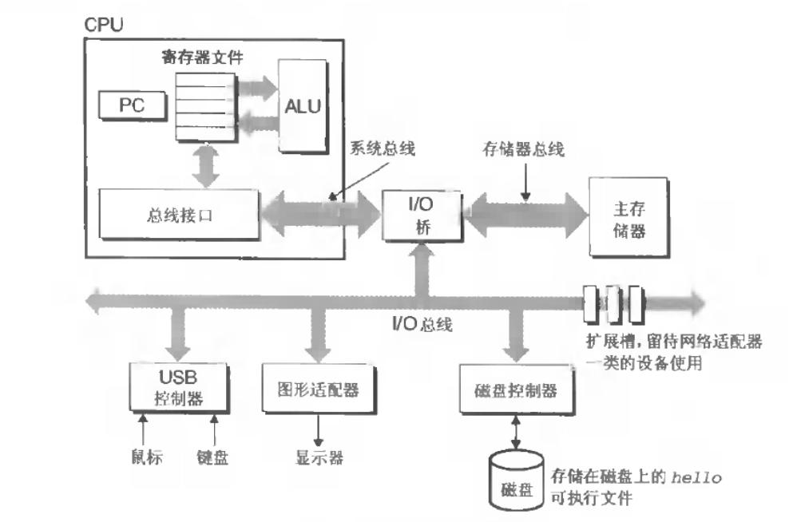
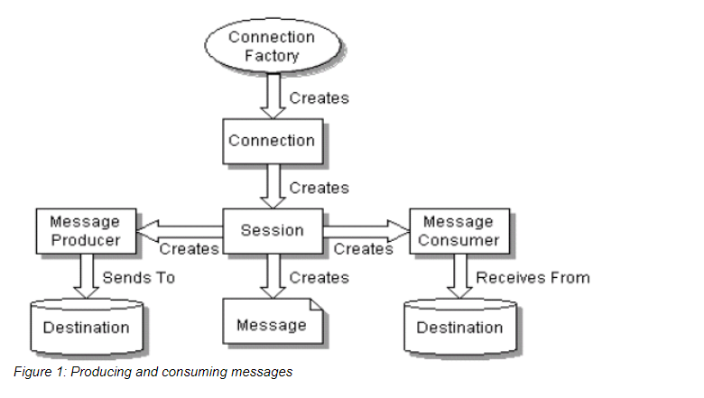

THINK DEPPER

1. 再下一层是什么？



系统：软件+硬件

Amdahl(阿姆德尔，Amdahl's law)定律：加速比，重要性决定性能提升倍率

信息的表示以及处理：
二进制对于机器来说的易用，可靠等特点(穿孔的有洞，无洞；导线高电压，低电压；等等) <br>
二进制位组合+解释器->表示的任意有限集合。 <br>
数字在计算中的表示(计算机用有限位对数字编码，结果太大导致的溢出问题):
    1. 字节-> 最小的可寻址的内存单位，而不是访问内存中单独的位。
    2. 机器级程序将内存视为一个非常大的字节数组->称为虚拟内存
    3. 内存的每个字节的标识->地址->所有【可能的】地址的集合称之为虚拟地址空间
    4. 16/10/2进制表示：
        0H(0x0) -> 0D -> 0000B
        1H -> 1D -> 0001B
        AH -> 10D -> 1010B
        FH -> 15D -> 1111B

        0x39A7F8 -> 11 1011 1010 0111 1111 1000
        1100100101111011 -> 0xC47B
        0xD5E4C -> 1101 0101 1110 0100 1100
        10 0110 1110 0111 1011 0101 -> 26E7B5

    5. 字数据的大小:
        字长(word size)：c中1个指针的大小(虚拟地址以一个字长来编码)，w位的机器,地址范围->0 ~ 2^w-1,最多访问2^w个字节
        32位机器的虚拟地址的空间的限制4GB。64位虚拟地址空间16EB
    6. 寻址和字节顺序：
        ->对象的地址是什么？(一般情况下，多字节对象被存储位连续的字节序列，地址是字节中最小的地址)
        ->在内存中中如何排列?(小端法(最低有效位在前)，大端法(最高有效位在前))
         * int值 -> 0x 1234567，起始位置位 0x 100
         大端法  0x100-> 01  小端法: 0x100 ->67
                0x101 ->23          0x101 ->45
                0x102 ->45          0x102 -> 23
                0x103 ->67          0x103 -> 01
    7. 字符串表示：
    8. 布尔代数：0，1的数据知识体系中的一种。起源乔治·布尔。 
        a = 01101001, b= 01010101
        ~a = 10010110 , ~b = 10101010
        a & b , a|b, a ^b 
    9. 逻辑运算
    10. 整数表示

2.JVM
3.Spring
4.Mybatis
5.Dubbo
6.MQ

    1. producer send
    2. broker get / broker send
    3. consumer listen




1. ConnectionFacory --create--> Connection
2. Connection --create--> Session
3. Session --create--> Message Producer
4. producer -- send to --> destination
5. consumer -- receives from --> destination

active mq: 
#### 1. ConnectionFactory --> Connection
```
    //broker url
   ConnectionFactory cf = new ActiveMQConnectionFactory("tcp://192.168.1.10:61616");  1
   con = cf.createConnection();  2
   con.start(); 3
```

1. setBrokerUrl
2. create ActiveMQConnection
```
uri 配置
<transportConnector name="auto" uri="auto://localhost:5671"/>
<transportConnector name="auto+ssl" uri="auto+ssl://localhost:5671"/>
<transportConnector name="auto+nio" uri="auto+nio://localhost:5671"/>
<transportConnector name="auto+nio+ssl" uri="auto+nio+ssl://localhost:5671"/>

--> META-INF/services/org/apache/activemq/transport/ 

private static final FactoryFinder TRANSPORT_FACTORY_FINDER = new FactoryFinder("META-INF/services/org/apache/activemq/transport/");

TransportFactory tf = TRANSPORT_FACTORYS.get(scheme);
tf.doConnect(location)   -> 格式化URI， createTransport(tcp->TcpTransport) 创建ActiveMQConnection(Connection 封装Transport，Transport封装传输层次(tcp协议默认 socket) socket.connect(remoteAddress, connectionTimeout);) 
```
    1. -> Transport transport = createTransport();
    2. -> ActiveMQConnection connection = createActiveMQConnection(transport, factoryStats);
    3. -> transport.start(); //tpc对应的是socket -> socket.connect到borker url
3. con.start()
    1. -> ActiveMQSession.start -> ActiveMQMessageConsumer.start

#### 2.Connection --create--> Session

 new ActiveMQSession

#### 3. session --create--> destination

des = session.createQueue("queue-test");
    -> new ActiveMQQueue(queueName)

#### 4.Session --create--> Message Producer

MessageProducer producer = session.createProducer(des);
    -> new ActiveMQMessageProducer

#### 5. producer -- send to --> destination


#### 6. consumer -- receives from --> destination


7.分布式（一致性，高性能，高可用）
分布式事务：

满足业务需求。放弃一些严格的事务特性

ACID
柔性事务：两阶段型，


服务模式：

可查询操作
幂等操作：通过业务本身实现幂等性；通过缓存所有请求与处理结果；
TCC操作：Try－Confirm－Cancle;
可补偿操作

解决方案：
可靠消息最终一致(异步确保型) 

本地消息系统

独立的消息服务系统：
    -> 消息服务子系统 Dubbo，Mybatis, Spring, Spring MVC,ActiveMQ
    -> 消息管理子系统
    -> 消息状态确认子系统
    -> 消息恢复子系统
    -> 实时消息服务

