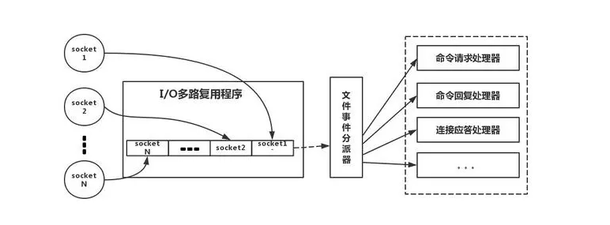

1. redis是什么？

K,V 内存存储器

2. redis数据结构

字符串->

SDS(simple dynamic string)实现(不是C字符串)。

struct sdshdr{
    int len; -> 已经使用的长度
    int free; -> 未使用空间
    char buf[]; -> string内容，保留c风格，最后一个字符串 \0(不计算在len中)，可以重用c中的函数
}

为什么需要重新定义String?
1. 获取长度时
    ->c是遍历获取统计。redis是get len(o(n) -> o(1))
2. 缓冲区溢出
    -> SDS检查free并自动扩充的功能
3. 减少重新分配
    -> String由长->短，除了修改buf内容，修改free,len,无需重新分配。
    -> String由短->长, 判断free,足够就添加，不够就自动扩充

链表 ->
```
typedef struct listNode {
    struct listNode *prev;
    struct listNode *next;
    void *value; 
}listNode

typedef struct list {
    listNode *head;
    listNode *tail;
    unsigned long len;
    //节点值复制函数
    //节点值释放函数
    //节点值对比函数
}list
```
->双端，无环

字典 ->
```
typedef struct dictht{
    //哈希数组
    dictEntry **table;
    //哈希表大小
    unsigned long size;
    // 总是size-1
    unsigned long sizemask
    //已经有的节点数
    unsigned long used
}

typedef struct dictEntry { ->节点数据
    void *key;
    union{
        void *val;
        uint64_t u64;
        int64_s s64;
    }v

    struct dictEntry *next; ->链表解决冲突
}
```

3.为什么这么快? 100000+QPS ->
    -> 完全基于内存。k,v操作，大部分操作是o(1)
    -> 自定义实现的数据结构简单
    -> 单线程处理模型，消除上下文切换，竞争条件 ->原子操作
    -> 多路I/O
    -> Redis直接构建VM

    多路I/O -> ?
    多路I/O复用模型是利用 select、poll、epoll 可以同时监察多个流的 I/O 事件的能力，在空闲的时候，会把当前线程阻塞掉，当有一个或多个流有 I/O 事件时，就从阻塞态中唤醒，于是程序就会轮询一遍所有的流（epoll 是只轮询那些真正发出了事件的流），并且只依次顺序的处理就绪的流，这种做法就避免了大量的无用操作。



4. redis的key淘汰机制
    redis的定期删除+惰性删除
    内存太高之后的内存淘汰机制(maxmemory-policy)

noeviction：当内存不足以容纳新写入数据时，新写入操作会报错。
allkeys-lru：当内存不足以容纳新写入数据时，在键空间中，移除最近最少使用的 Key。（推荐使用，目前项目在用这种）(最近最久使用算法)
allkeys-random：当内存不足以容纳新写入数据时，在键空间中，随机移除某个 Key。（应该也没人用吧，你不删最少使用 Key，去随机删）
volatile-lru：当内存不足以容纳新写入数据时，在设置了过期时间的键空间中，移除最近最少使用的 Key。这种情况一般是把 Redis 既当缓存，又做持久化存储的时候才用。（不推荐）
volatile-random：当内存不足以容纳新写入数据时，在设置了过期时间的键空间中，随机移除某个 Key。（依然不推荐）
volatile-ttl：当内存不足以容纳新写入数据时，在设置了过期时间的键空间中，有更早过期时间的 Key 优先移除。（不推荐）


4. 使用redis可能的问题 ->
 
  Redis和数据库双写一致性的问题
    最终一致性(缓存能做的只是最终一致性，只能降低不一致发生的概率)
        -> 更新策略(更新数据库，再删缓存。其次，因为可能存在删除缓存失败的问题，提供一个补偿措施即可，例如利用消息队列)
    强一致性(不可放入缓存，利用DB提供的事务)
  缓存穿透（大量的访问请求不存在的缓存，所有的查询都涌入数据库导致数据库崩溃的情况）
    -> 利用互斥锁，缓存失效的时候，先去获得锁，得到锁了，再去请求数据库。没得到锁，则休眠一段时间重试。
    -> 采用异步更新策略，无论 Key 是否取到值，都直接返回。Value 值中维护一个缓存失效时间，缓存如果过期，异步起一个线程去读数据库，更新缓存。需要做缓存预热(项目启动前，先加载缓存)操作。
    -> 提供一个能迅速判断请求是否有效的拦截机制，比如，利用布隆过滤器，内部维护一系列合法有效的 Key。迅速判断出，请求所携带的 Key 是否合法有效。如果不合法，则直接返回。


  缓存雪崩(缓存雪崩，即缓存同一时间大面积的失效，这个时候又来了一波请求，结果请求都怼到数据库上，从而导致数据库连接异常。)
    -> 给缓存的失效时间，加上一个随机值，避免集体失效。
    -> 使用互斥锁，但是该方案吞吐量明显下降了。
    -> 双缓存。我们有两个缓存，缓存 A 和缓存 B。缓存 A 的失效时间为 20 分钟，缓存 B 不设失效时间。自己做缓存预热操作。
    然后细分以下几个小点：从缓存 A 读数据库，有则直接返回；A 没有数据，直接从 B 读数据，直接返回，并且异步启动一个更新线程，更新线程同时更新缓存 A 和缓存 B。

  redis的并发竞争key
    -> 如果对这个 Key 操作，不要求顺序
        准备一个分布式锁，大家去抢锁，抢到锁就做 set 操作即可，比较简单
    -> 如果对这个 Key 操作，要求顺序
        期望按照 key1 的 value 值按照 valueA > valueB > valueC 的顺序变化。这种时候我们在数据写入数据库的时候，需要保存一个时间戳
