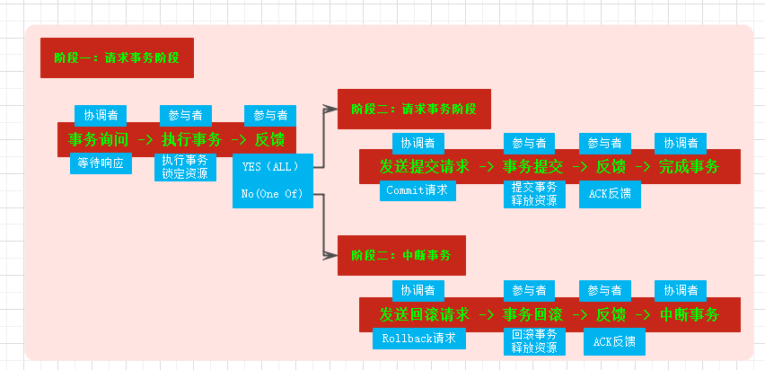
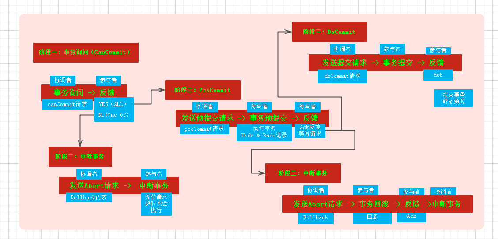

## 事务详解
事务是一个原子的执行单元，在这个单元种的操作要么都执行，要么都不执行。不会出现一半的业务成功，一半的业务失败。  

数据库事务支持ACID特性，且有不同的隔离级别。分布式事务支持不了严格的ACID，基于CAP，BASE等原理保证数据的最终一致性。

##### 数据库事务
* 特性(ACID)
    - A(Atomacity,原子性)：操作单元不可分离，要么都执行，有么都不执行。不存在一个操作单元一半执行成功，一半失败的情况。
    - C(Consistency,一致性)：事务执行完之后，所有的数据都是保持一致性的。
    - I(Isolation,隔离性)：不同的事务的执行相互不影响
    - D(Durability,持久性)：事务执行的结果是持久的。
* 隔离级别
    - 未提交读:一个事务可以读到其他事务还没有提交的数据,可能读到脏数据(一个事务的数据还没有提交被其他事务读到，之后事务回滚未提交的数据，那么读到的这部分数据便是脏数据)
    - 已提交读：一个事务的数据只能是提交了之后才可以被其他事务读到。这个期间可能出现幻读(同样的sql，一个事务第一次读到的数据与第二次读到的事务不一致)
    - 可重复读：同样的sql,在一个事务里读到的始终是一致的
    - 串行化:所有的sql操作都是串行执行
* 事务的实现方式
锁是实现事务的方式。MySql锁可以分为表锁，行锁等，不同的引擎支持的锁不同。  

InnoDB中的锁的算法： 

* Record Lock:单个行记录上的锁
* Gap Lock:间隙锁，锁定一个范围，但是不包含记录本身 
* Next-Key Lock: Record Lock + Gap Lock。InnoDB的中实现锁的算法是next-key。在查询唯一索引的列的时候Next-Key降级未Record Lock实现并发优化。

##### 分布式事务
分布式应用的各节点分布在不同的机器上通过网络进行通信。由于网络本身的不可靠性会导致各种问题，如通信异常，网络分区(脑裂)，三态，节点故障等都会出现数据不一致。为保证数据一致，需要实现分布式事务。分布式应用本身还会需要满足高可用，高性能，高并发的特定。如果分布式事务的实现同样遵循本地或集中式的ACID的话，会导致可用性与一致性的冲突。

* 分布式事务理论基础(CAP & BASE)
    - CAP:CAP代表C(Consistency，一致性),A(Availability,可用性),P(Partition Tolerance，分区容错性)三个不同的需求。CAP理论表明，分布式系统不能够同时满足这3个特性。然而分布式系统需要满足P的需求，所以在实现P的基础上根据业务需求实现C与A的平衡。
        + C:一致性是数据的多个副本是一致的。且在执行更新操作之后，数据仍然是一致的。
        + A:可用性是指对于每一个请求能够在有限的时间内返回结果。
        + P:分区容错性是指在分布式系统在遇到任何网络分区故障的时候，系统仍然能够保证对外提供满足一致性和可用性的服务。
    - BASE:BASE是指Basically Available(基本可用)，Soft State(软状态)以及Eventually Consistent(最终一致性)。该思想是一致性和可用性权衡的结果。
        + Basically Available:系统出现故障的时候，运行系统损失部分可用性(响应时间上的损失；功能上的损失，部分功能不可用或降级)
        + Soft State:允许数据存在中间的状态，且该中间状态不会影响系统的可用性
        + Eventually Consistent:在系统中的数据副本，经过一段时间之后最终会达到一致性。
* 一致性协议
    - 两阶段提交
        + 
    - 三阶段提交
        + 
    - Paxos
        + Paxos中涉及到Proposer，Acceptor,Leaner角色。提议包装成Propose，Proposer提出提议Acceptor决策，Learner学习Propose
        + Paxos中假设没有拜占延将军问题(数据不被篡改)
        + Paxos分阶段以及做一些promise来决策整个过程
